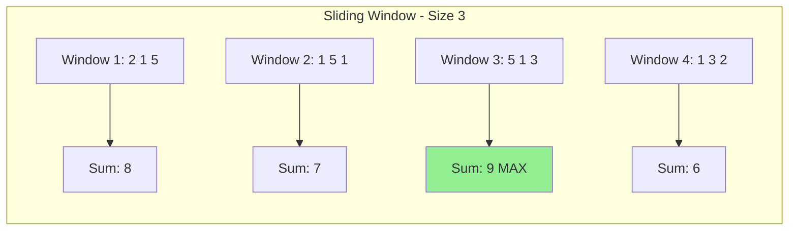
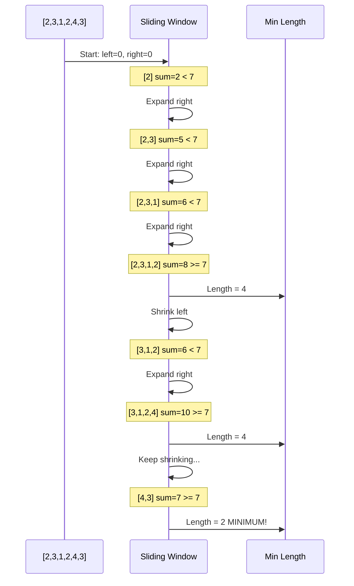

# Chapter 3: Arrays and Strings

## 1. Array Fundamentals

An **array** is a collection of elements of the same type stored in **contiguous memory locations**. Each element can be accessed directly using its **index**.

### Core Properties:

**Fixed Size**: Size is determined at creation (for static arrays)

**Contiguous Memory**: Elements are stored next to each other in memory

**Direct Access**: O(1) time to access any element by index

**Zero-Indexed**: First element is at index 0 (in C++)

### Memory Layout:

```
Array: [10, 20, 30, 40, 50]
Index:   0   1   2   3   4

Memory Addresses (example):
Address: 1000, 1004, 1008, 1012, 1016
         [10]  [20]  [30]  [40]  [50]
```

Each integer takes 4 bytes, so elements are 4 bytes apart.

**Formula for accessing element at index i:**
```
address_of_arr[i] = base_address + (i × size_of_element)
```

This is why array access is O(1) - it's just arithmetic!

### Basic Array Operations:

```cpp
#include <iostream>
using namespace std;

int main() {
    // Declaration and initialization
    int arr[5] = {10, 20, 30, 40, 50};
    
    // Access element
    cout << "Element at index 2: " << arr[2] << endl;  // 30
    
    // Modify element
    arr[2] = 35;
    cout << "Modified element: " << arr[2] << endl;    // 35
    
    // Iterate through array
    cout << "All elements: ";
    for (int i = 0; i < 5; i++) {
        cout << arr[i] << " ";
    }
    cout << endl;
    
    // Size of array
    int size = sizeof(arr) / sizeof(arr[0]);
    cout << "Array size: " << size << endl;  // 5
    
    return 0;
}
```

### Array Complexity:

| Operation | Time Complexity | Notes |
|-----------|----------------|-------|
| **Access by index** | O(1) | Direct memory calculation |
| **Insert at end** | O(1) | If space available |
| **Insert at beginning** | O(n) | Must shift all elements |
| **Delete at end** | O(1) | Just decrease size |
| **Delete at beginning** | O(n) | Must shift all elements |
| **Search (unsorted)** | O(n) | Linear search required |
| **Search (sorted)** | O(log n) | Binary search possible |

---

## 2. Static vs Dynamic Arrays

### Static Arrays

**Definition**: Fixed-size arrays allocated at compile time.

```cpp
int staticArr[5];  // Size must be known at compile time
```

**Characteristics:**
- Size cannot change after creation
- Allocated on the **stack** (faster, limited size)
- Automatically deallocated when out of scope
- No runtime overhead for size management

**Advantages:**
- ✅ Faster access (no indirection)
- ✅ No memory allocation overhead
- ✅ Cache-friendly (contiguous memory)

**Disadvantages:**
- ❌ Fixed size (cannot grow)
- ❌ Stack memory limited (~1-8 MB typically)
- ❌ Size must be compile-time constant

```cpp
int main() {
    int arr[1000000];  // Might cause stack overflow!
    // Stack size is limited
}
```

---

### Dynamic Arrays (C++ Vectors)

**Definition**: Resizable arrays allocated at runtime on the heap.

```cpp
#include <vector>
vector<int> dynamicArr;  // Size can change
```

**Characteristics:**
- Size can grow and shrink dynamically
- Allocated on the **heap** (larger capacity)
- Must be manually managed (or use smart containers)
- Slight overhead for size tracking

**How Vectors Work Internally:**

When a vector runs out of capacity:
1. Allocate new array with **double the capacity**
2. Copy all elements to new array
3. Delete old array

```cpp
#include <iostream>
#include <vector>
using namespace std;

int main() {
    vector<int> v;
    
    cout << "Capacity changes:" << endl;
    for (int i = 0; i < 10; i++) {
        v.push_back(i);
        cout << "Size: " << v.size() 
             << ", Capacity: " << v.capacity() << endl;
    }
    
    return 0;
}
```

**Output:**
```
Size: 1, Capacity: 1
Size: 2, Capacity: 2
Size: 3, Capacity: 4
Size: 4, Capacity: 4
Size: 5, Capacity: 8
Size: 6, Capacity: 8
Size: 7, Capacity: 8
Size: 8, Capacity: 8
Size: 9, Capacity: 16
Size: 10, Capacity: 16
```

**Amortized Analysis:**
- Most insertions: O(1)
- Occasional resize: O(n)
- **Amortized time: O(1)** per insertion

---

### Common Vector Operations:

```cpp
#include <vector>
#include <iostream>
using namespace std;

int main() {
    vector<int> v;
    
    // Add elements
    v.push_back(10);        // [10]
    v.push_back(20);        // [10, 20]
    v.push_back(30);        // [10, 20, 30]
    
    // Access elements
    cout << v[0] << endl;         // 10
    cout << v.at(1) << endl;      // 20 (with bounds checking)
    cout << v.front() << endl;    // 10 (first element)
    cout << v.back() << endl;     // 30 (last element)
    
    // Size operations
    cout << "Size: " << v.size() << endl;           // 3
    cout << "Capacity: " << v.capacity() << endl;   // Usually >= 3
    cout << "Empty? " << v.empty() << endl;         // false
    
    // Modify
    v[1] = 25;              // [10, 25, 30]
    
    // Remove last element
    v.pop_back();           // [10, 25]
    
    // Clear all elements
    v.clear();              // []
    
    // Reserve capacity (avoid reallocations)
    v.reserve(100);         // Allocate space for 100 elements
    
    // Resize with default value
    v.resize(5, 0);         // [0, 0, 0, 0, 0]
    
    return 0;
}
```

---

### Static vs Dynamic Comparison:

| Feature | Static Array | Dynamic Array (Vector) |
|---------|--------------|------------------------|
| **Size** | Fixed at compile time | Can grow/shrink |
| **Memory** | Stack | Heap |
| **Allocation** | Compile time | Runtime |
| **Performance** | Slightly faster | Slight overhead |
| **Flexibility** | Limited | High |
| **Use Case** | Known size, small data | Unknown size, large data |

**Rule of Thumb:**
- Use **static arrays** when size is known and small (< 10K elements)
- Use **vectors** for everything else (default choice in modern C++)

---

## 3. 1D & 2D Arrays

### 1D Arrays (One-Dimensional)

A simple linear sequence of elements.

```cpp
#include <iostream>
using namespace std;

int main() {
    // Static 1D array
    int arr1[5] = {1, 2, 3, 4, 5};
    
    // Dynamic 1D array (vector)
    vector<int> arr2 = {10, 20, 30, 40, 50};
    
    // Traversal
    for (int i = 0; i < 5; i++) {
        cout << arr1[i] << " ";
    }
    cout << endl;
    
    // Range-based for loop (C++11)
    for (int x : arr2) {
        cout << x << " ";
    }
    cout << endl;
    
    return 0;
}
```

---

### 2D Arrays (Two-Dimensional)

A matrix or grid structure - array of arrays.

**Visual Representation:**
```
2D Array (3x4 matrix):

     Col 0  Col 1  Col 2  Col 3
Row 0:  1     2      3      4
Row 1:  5     6      7      8
Row 2:  9     10     11     12

Access: arr[row][col]
Example: arr[1][2] = 7
```

**Static 2D Array:**

```cpp
#include <iostream>
using namespace std;

int main() {
    // Declare and initialize
    int matrix[3][4] = {
        {1, 2, 3, 4},
        {5, 6, 7, 8},
        {9, 10, 11, 12}
    };
    
    // Access element at row 1, column 2
    cout << "Element at [1][2]: " << matrix[1][2] << endl;  // 7
    
    // Traverse 2D array
    cout << "Matrix:" << endl;
    for (int i = 0; i < 3; i++) {           // Rows
        for (int j = 0; j < 4; j++) {       // Columns
            cout << matrix[i][j] << " ";
        }
        cout << endl;
    }
    
    return 0;
}
```

---

**Dynamic 2D Array (Vector of Vectors):**

```cpp
#include <iostream>
#include <vector>
using namespace std;

int main() {
    // Create 3x4 matrix initialized with zeros
    vector<vector<int>> matrix(3, vector<int>(4, 0));
    
    // Fill with values
    int value = 1;
    for (int i = 0; i < 3; i++) {
        for (int j = 0; j < 4; j++) {
            matrix[i][j] = value++;
        }
    }
    
    // Access and print
    cout << "Matrix:" << endl;
    for (int i = 0; i < matrix.size(); i++) {
        for (int j = 0; j < matrix[i].size(); j++) {
            cout << matrix[i][j] << " ";
        }
        cout << endl;
    }
    
    // Add a new row
    matrix.push_back({13, 14, 15, 16});
    
    cout << "Rows: " << matrix.size() << endl;        // 4
    cout << "Cols: " << matrix[0].size() << endl;     // 4
    
    return 0;
}
```

---

**Common 2D Array Patterns:**

**1. Row-wise Traversal:**
```cpp
for (int i = 0; i < rows; i++) {
    for (int j = 0; j < cols; j++) {
        // Process matrix[i][j]
    }
}
```

**2. Column-wise Traversal:**
```cpp
for (int j = 0; j < cols; j++) {
    for (int i = 0; i < rows; i++) {
        // Process matrix[i][j]
    }
}
```

**3. Diagonal Traversal:**
```cpp
// Main diagonal (top-left to bottom-right)
for (int i = 0; i < n; i++) {
    cout << matrix[i][i] << " ";
}
```

**4. Spiral Traversal:**
```cpp
// Right → Down → Left → Up (in layers)
int top = 0, bottom = rows - 1;
int left = 0, right = cols - 1;

while (top <= bottom && left <= right) {
    // Traverse right
    for (int j = left; j <= right; j++)
        cout << matrix[top][j] << " ";
    top++;
    
    // Traverse down
    for (int i = top; i <= bottom; i++)
        cout << matrix[i][right] << " ";
    right--;
    
    // Traverse left
    if (top <= bottom) {
        for (int j = right; j >= left; j--)
            cout << matrix[bottom][j] << " ";
        bottom--;
    }
    
    // Traverse up
    if (left <= right) {
        for (int i = bottom; i >= top; i--)
            cout << matrix[i][left] << " ";
        left++;
    }
}
```

---

## 4. Prefix Sum Technique

**Problem**: Given an array, answer multiple range sum queries efficiently.

**Naive Approach:**
```cpp
// For each query [L, R], sum elements from index L to R
int rangeSum(int arr[], int L, int R) {
    int sum = 0;
    for (int i = L; i <= R; i++) {
        sum += arr[i];
    }
    return sum;
}
// Time: O(n) per query
// For k queries: O(k × n)
```

**Optimized with Prefix Sum:**

**Idea**: Precompute cumulative sums, then answer queries in O(1).

**Prefix Sum Array:**
```
Original:  [3, 1, 4, 2, 5]
Prefix:    [3, 4, 8, 10, 15]

prefix[i] = sum of elements from index 0 to i
```

**Formula:**
```
sum(L, R) = prefix[R] - prefix[L-1]
```

**Implementation:**

```cpp
#include <iostream>
#include <vector>
using namespace std;

class PrefixSum {
private:
    vector<int> prefix;
    
public:
    // Build prefix sum array: O(n)
    PrefixSum(vector<int>& arr) {
        int n = arr.size();
        prefix.resize(n);
        
        prefix[0] = arr[0];
        for (int i = 1; i < n; i++) {
            prefix[i] = prefix[i-1] + arr[i];
        }
    }
    
    // Query range sum [L, R]: O(1)
    int rangeSum(int L, int R) {
        if (L == 0) return prefix[R];
        return prefix[R] - prefix[L-1];
    }
};

int main() {
    vector<int> arr = {3, 1, 4, 2, 5};
    PrefixSum ps(arr);
    
    cout << "Original array: ";
    for (int x : arr) cout << x << " ";
    cout << endl;
    
    // Multiple queries
    cout << "Sum [0, 2]: " << ps.rangeSum(0, 2) << endl;  // 3+1+4 = 8
    cout << "Sum [1, 3]: " << ps.rangeSum(1, 3) << endl;  // 1+4+2 = 7
    cout << "Sum [2, 4]: " << ps.rangeSum(2, 4) << endl;  // 4+2+5 = 11
    
    return 0;
}
```

**Output:**
```
Original array: 3 1 4 2 5
Sum [0, 2]: 8
Sum [1, 3]: 7
Sum [2, 4]: 11
```

---

**Visual Explanation:**

```
Array:   [3,  1,  4,  2,  5]
Index:    0   1   2   3   4

Prefix:  [3,  4,  8, 10, 15]

Query: Sum from index 1 to 3
Answer = prefix[3] - prefix[0]
       = 10 - 3
       = 7
       = arr[1] + arr[2] + arr[3]
       = 1 + 4 + 2 ✓
```

---

**2D Prefix Sum:**

For matrices, we can extend this idea to answer 2D range queries.

```cpp
#include <iostream>
#include <vector>
using namespace std;

class PrefixSum2D {
private:
    vector<vector<int>> prefix;
    
public:
    PrefixSum2D(vector<vector<int>>& matrix) {
        int rows = matrix.size();
        int cols = matrix[0].size();
        
        prefix.resize(rows + 1, vector<int>(cols + 1, 0));
        
        // Build prefix sum (1-indexed for easier calculation)
        for (int i = 1; i <= rows; i++) {
            for (int j = 1; j <= cols; j++) {
                prefix[i][j] = matrix[i-1][j-1] 
                             + prefix[i-1][j] 
                             + prefix[i][j-1] 
                             - prefix[i-1][j-1];
            }
        }
    }
    
    // Query sum of rectangle from (r1,c1) to (r2,c2)
    int rangeSum(int r1, int c1, int r2, int c2) {
        r1++; c1++; r2++; c2++;  // Convert to 1-indexed
        
        return prefix[r2][c2] 
             - prefix[r1-1][c2] 
             - prefix[r2][c1-1] 
             + prefix[r1-1][c1-1];
    }
};

int main() {
    vector<vector<int>> matrix = {
        {1, 2, 3},
        {4, 5, 6},
        {7, 8, 9}
    };
    
    PrefixSum2D ps(matrix);
    
    // Sum of submatrix from (1,1) to (2,2)
    cout << "Sum of submatrix: " << ps.rangeSum(1, 1, 2, 2) << endl;
    // 5 + 6 + 8 + 9 = 28
    
    return 0;
}
```

---

**Use Cases:**
- Range sum queries
- Subarray problems
- Image processing (integral images)
- Cumulative frequency calculations

**Complexity:**
- Preprocessing: O(n) for 1D, O(n×m) for 2D
- Query: O(1)
- Space: O(n) for 1D, O(n×m) for 2D

---

## 5. Sliding Window Technique

**Problem Pattern**: Find something (max, min, sum, etc.) among all **contiguous subarrays** of a fixed or variable size.

**Naive Approach**: Generate all subarrays and check each one - O(n²) or O(n³)

**Optimized Approach**: Sliding Window - O(n)

### Fixed-Size Sliding Window

**Example**: Find maximum sum of any subarray of size k.

```cpp
#include <iostream>
#include <vector>
#include <algorithm>
using namespace std;

int maxSumSubarray(vector<int>& arr, int k) {
    int n = arr.size();
    if (n < k) return -1;
    
    // Calculate sum of first window
    int windowSum = 0;
    for (int i = 0; i < k; i++) {
        windowSum += arr[i];
    }
    
    int maxSum = windowSum;
    
    // Slide the window
    for (int i = k; i < n; i++) {
        windowSum += arr[i];        // Add new element
        windowSum -= arr[i - k];    // Remove old element
        maxSum = max(maxSum, windowSum);
    }
    
    return maxSum;
}

int main() {
    vector<int> arr = {2, 1, 5, 1, 3, 2};
    int k = 3;
    
    cout << "Array: ";
    for (int x : arr) cout << x << " ";
    cout << endl;
    
    cout << "Max sum of subarray of size " << k << ": ";
    cout << maxSumSubarray(arr, k) << endl;  // 9 (5+1+3)
    
    return 0;
}
```

**Visual Representation:**



**How it works:**
```
Array: [2, 1, 5, 1, 3, 2]
Window size k = 3

Step 1: [2, 1, 5] → Sum = 8
Step 2: [1, 5, 1] → Remove 2, Add 1 → Sum = 8 - 2 + 1 = 7
Step 3: [5, 1, 3] → Remove 1, Add 3 → Sum = 7 - 1 + 3 = 9 ✓
Step 4: [1, 3, 2] → Remove 5, Add 2 → Sum = 9 - 5 + 2 = 6
```

---

### Variable-Size Sliding Window

**Example**: Find smallest subarray with sum ≥ target.

```cpp
#include <iostream>
#include <vector>
#include <climits>
using namespace std;

int minSubarrayLen(int target, vector<int>& arr) {
    int n = arr.size();
    int minLen = INT_MAX;
    int windowSum = 0;
    int left = 0;
    
    for (int right = 0; right < n; right++) {
        windowSum += arr[right];  // Expand window
        
        // Shrink window while valid
        while (windowSum >= target) {
            minLen = min(minLen, right - left + 1);
            windowSum -= arr[left];
            left++;
        }
    }
    
    return minLen == INT_MAX ? 0 : minLen;
}

int main() {
    vector<int> arr = {2, 3, 1, 2, 4, 3};
    int target = 7;
    
    cout << "Smallest subarray with sum >= " << target << ": ";
    cout << minSubarrayLen(target, arr) << endl;  // 2 ([4,3])
    
    return 0;
}
```

**Visualization:**



---

**Common Sliding Window Patterns:**

**1. Fixed Size Window:**
```cpp
// Template
for (int i = 0; i < k; i++) {
    // Initialize window
}
for (int i = k; i < n; i++) {
    // Remove arr[i-k], add arr[i]
    // Update result
}
```

**2. Variable Size Window (Expand/Shrink):**
```cpp
// Template
int left = 0;
for (int right = 0; right < n; right++) {
    // Add arr[right] to window
    while (/* window invalid */) {
        // Shrink from left
        left++;
    }
    // Update result
}
```

**Use Cases:**
- Maximum/minimum sum of subarray of size k
- Longest substring with k distinct characters
- Minimum window substring
- Subarrays with sum equal to target

**Complexity:**
- Time: O(n) - each element visited at most twice
- Space: O(1) or O(k) depending on problem

---

## 6. String Basics in C++

Strings are sequences of characters. In C++, we have two main ways to work with strings:

### C-Style Strings (Character Arrays)

```cpp
#include <iostream>
#include <cstring>
using namespace std;

int main() {
    char str1[] = "Hello";          // Automatically null-terminated
    char str2[20] = "World";
    
    // Length
    cout << "Length: " << strlen(str1) << endl;  // 5
    
    // Copy
    strcpy(str2, str1);
    cout << "Copied: " << str2 << endl;
    
    // Concatenate
    char str3[20] = "Hello ";
    strcat(str3, "World");
    cout << "Concatenated: " << str3 << endl;  // Hello World
    
    // Compare
    if (strcmp(str1, str2) == 0) {
        cout << "Strings are equal" << endl;
    }
    
    return 0;
}
```

**Issues with C-Strings:**
- Manual memory management
- Buffer overflow risks
- No bounds checking
- Cumbersome operations

---

### C++ Strings (std::string)

**Modern, safer, and recommended approach:**

```cpp
#include <iostream>
#include <string>
using namespace std;

int main() {
    // Declaration and initialization
    string str1 = "Hello";
    string str2("World");
    string str3(5, 'A');  // "AAAAA"
    
    // Concatenation
    string result = str1 + " " + str2;
    cout << result << endl;  // Hello World
    
    // Length
    cout << "Length: " << str1.length() << endl;  // 5
    cout << "Size: " << str1.size() << endl;      // 5 (same as length)
    
    // Access characters
    cout << "First char: " << str1[0] << endl;      // H
    cout << "Last char: " << str1[str1.size()-1] << endl;  // o
    
    // Modify
    str1[0] = 'h';
    cout << "Modified: " << str1 << endl;  // hello
    
    // Substring
    string sub = result.substr(0, 5);  // "Hello"
    cout << "Substring: " << sub << endl;
    
    // Find
    size_t pos = result.find("World");
    if (pos != string::npos) {
        cout << "Found 'World' at position: " << pos << endl;  // 6
    }
    
    // Compare
    if (str1 == str2) {
        cout << "Equal" << endl;
    } else {
        cout << "Not equal" << endl;
    }
    
    // Empty check
    string empty;
    cout << "Is empty? " << empty.empty() << endl;  // true
    
    // Clear
    str1.clear();
    cout << "After clear: '" << str1 << "'" << endl;  // ''
    
    return 0;
}
```

---

**Common String Operations:**

```cpp
#include <iostream>
#include <string>
#include <algorithm>
using namespace std;

int main() {
    string s = "Hello World";
    
    // Convert to uppercase
    transform(s.begin(), s.end(), s.begin(), ::toupper);
    cout << s << endl;  // HELLO WORLD
    
    // Convert to lowercase
    transform(s.begin(), s.end(), s.begin(), ::tolower);
    cout << s << endl;  // hello world
    
    // Reverse
    reverse(s.begin(), s.end());
    cout << s << endl;  // dlrow olleh
    
    // Sort
    string s2 = "dcba";
    sort(s2.begin(), s2.end());
    cout << s2 << endl;  // abcd
    
    // Append
    s2.append(" efgh");
    cout << s2 << endl;  // abcd efgh
    
    // Insert
    s2.insert(4, "XYZ");
    cout << s2 << endl;  // abcdXYZ efgh
    
    // Erase
    s2.erase(4, 3);  // Remove 3 chars starting at position 4
    cout << s2 << endl;  // abcd efgh
    
    // Replace
    s2.replace(5, 4, "1234");
    cout << s2 << endl;  // abcd 1234
    
    return 0;
}
```

---

**String Iteration:**

```cpp
string s = "Hello";

// Method 1: Index
for (int i = 0; i < s.length(); i++) {
    cout << s[i] << " ";
}

// Method 2: Iterator
for (string::iterator it = s.begin(); it != s.end(); ++it) {
    cout << *it << " ";
}

// Method 3: Range-based (C++11) - RECOMMENDED
for (char c : s) {
    cout << c << " ";
}
```

---

**String to Number Conversion:**

```cpp
#include <string>
#include <iostream>
using namespace std;

int main() {
    // String to int
    string num1 = "123";
    int n1 = stoi(num1);
    cout << n1 + 1 << endl;  // 124
    
    // String to long
    string num2 = "123456789";
    long n2 = stol(num2);
    
    // String to double
    string num3 = "3.14";
    double d = stod(num3);
    cout << d * 2 << endl;  // 6.28
    
    // Int to string
    int x = 456;
    string str = to_string(x);
    cout << str + "789" << endl;  // 456789
    
    return 0;
}
```

---

**Common String Complexity:**

| Operation | Time Complexity |
|-----------|----------------|
| Access s[i] | O(1) |
| Append | O(1) amortized |
| Insert at position i | O(n) |
| Erase | O(n) |
| Find substring | O(n × m) |
| Concatenation | O(n + m) |
| Substring | O(k) where k = substring length |
| Compare | O(min(n, m)) |

---

## Real-Life Analogies

### 1. Books on Shelves (Array Index)

Imagine a bookshelf in a library:

**Array = Bookshelf**

```
Shelf Position:  0      1      2      3      4
Books:         [Math] [Sci] [Hist] [Art] [Lit]
```

**Why Arrays are Perfect for This:**

**Direct Access (O(1))**: Just like you can directly grab the book at position 2 without touching positions 0 and 1, arrays let you access `arr[2]` instantly. You know exactly where it is!

**Fixed Positions**: Books stay in their assigned spots. Similarly, array elements have fixed index positions.

**Sequential Storage**: Books are arranged in order, left to right. Array elements are stored sequentially in memory.

**Finding a Book:**
- **If you know the position**: "Give me the book at position 3" → O(1) direct access
- **If you don't know the position**: "Find the History book" → O(n) must check each book

```cpp
// Direct access - like knowing the exact shelf position
string books[5] = {"Math", "Science", "History", "Art", "Literature"};
cout << books[2];  // "History" - instant access!

// Search - like looking through books one by one
string findBook(string books[], int n, string target) {
    for (int i = 0; i < n; i++) {
        if (books[i] == target) {
            return "Found at position " + to_string(i);
        }
    }
    return "Not found";
}
```

**Inserting a New Book:**
- **At the end**: Easy, just place it in the next empty spot → O(1)
- **In the middle**: Must shift all books to the right to make space → O(n)

**Real-World Parallel**: This is why librarians maintain organized shelves with specific positions, making it easy to find books quickly!

---

### 2. Calendar Days (Array of Days)

Think of a month's calendar:

```
January 2026:
Index:  0   1   2   3   4   5   6   ... 30
Day:   [1] [2] [3] [4] [5] [6] [7] ... [31]
```

**Application 1: Prefix Sum for Running Total**

Imagine tracking daily sales in a store:

```
Daily Sales:  [100, 150, 200, 120, 180, 90, 160]
Day:            Mon  Tue  Wed  Thu  Fri  Sat Sun

Question: "What were total sales from Wednesday to Friday?"
```

**Without Prefix Sum:**
```
Sum = 200 + 120 + 180 = 500
(Must add each day individually)
```

**With Prefix Sum:**
```
Prefix: [100, 250, 450, 570, 750, 840, 1000]

Total Wed-Fri = prefix[Fri] - prefix[Tue]
              = 750 - 250
              = 500 ✓
```

```cpp
#include <iostream>
#include <vector>
using namespace std;

int main() {
    vector<int> sales = {100, 150, 200, 120, 180, 90, 160};
    vector<int> prefix(7);
    
    // Build prefix sum
    prefix[0] = sales[0];
    for (int i = 1; i < 7; i++) {
        prefix[i] = prefix[i-1] + sales[i];
    }
    
    // Query: Total from Wed (index 2) to Fri (index 4)
    int total = prefix[4] - prefix[1];  // 750 - 250 = 500
    cout << "Sales Wed-Fri: $" << total << endl;
    
    // Query: Total for entire week
    cout << "Total week: $" << prefix[6] << endl;  // $1000
    
    return 0;
}
```

---

**Application 2: Sliding Window for Weekly Patterns**

Question: "What was the best 3-day consecutive sales period?"

```cpp
int bestThreeDays(vector<int>& sales) {
    int windowSum = sales[0] + sales[1] + sales[2];  // Mon-Wed
    int maxSum = windowSum;
    int bestStart = 0;
    
    for (int i = 3; i < sales.size(); i++) {
        windowSum = windowSum - sales[i-3] + sales[i];
        if (windowSum > maxSum) {
            maxSum = windowSum;
            bestStart = i - 2;
        }
    }
    
    string days[] = {"Mon", "Tue", "Wed", "Thu", "Fri", "Sat", "Sun"};
    cout << "Best period: " << days[bestStart] << " to " 
         << days[bestStart+2] << endl;
    
    return maxSum;
}

// Output: Best period: Wed to Fri (500)
```

**Real-World Applications:**
- Weather patterns: "Average temperature over past 7 days"
- Stock prices: "Moving average"
- Website traffic: "Peak usage hours"
- Workout tracking: "Total calories this week"

---

## Visualization: Array Index Diagram

```
Array Memory Layout:

┌─────────────────────────────────────────────────────┐
│  Array: scores[5] = {85, 92, 78, 95, 88}           │
└─────────────────────────────────────────────────────┘

Memory Addresses and Values:

Address:    1000      1004      1008      1012      1016
           ┌─────┐   ┌─────┐   ┌─────┐   ┌─────┐   ┌─────┐
           │  85 │   │  92 │   │  78 │   │  95 │   │  88 │
           └─────┘   └─────┘   └─────┘   └─────┘   └─────┘
Index:        0         1         2         3         4
              ↑                                       ↑
            First                                   Last
         scores[0]                             scores[4]

Each integer = 4 bytes
Total memory = 5 × 4 = 20 bytes

Accessing scores[3]:
  Address = base_address + (index × element_size)
          = 1000 + (3 × 4)
          = 1012
  Value at 1012 = 95 ✓

Time to access any element = O(1) - just math!
```

---

## Complete Code Examples

### Example 1: Prefix Sum - Subarray Sum Queries

```cpp
#include <iostream>
#include <vector>
using namespace std;

class SubarraySum {
private:
    vector<int> prefix;
    
public:
    SubarraySum(vector<int>& arr) {
        int n = arr.size();
        prefix.resize(n);
        
        // Build prefix sum
        prefix[0] = arr[0];
        for (int i = 1; i < n; i++) {
            prefix[i] = prefix[i-1] + arr[i];
        }
        
        cout << "Original array: ";
        for (int x : arr) cout << x << " ";
        cout << endl;
        
        cout << "Prefix sum: ";
        for (int x : prefix) cout << x << " ";
        cout << endl << endl;
    }
    
    int rangeSum(int left, int right) {
        if (left == 0) return prefix[right];
        return prefix[right] - prefix[left - 1];
    }
    
    // Find number of subarrays with sum = k
    int countSubarraysWithSum(int k) {
        int count = 0;
        int n = prefix.size();
        
        for (int i = 0; i < n; i++) {
            for (int j = i; j < n; j++) {
                if (rangeSum(i, j) == k) {
                    count++;
                }
            }
        }
        return count;
    }
};

int main() {
    vector<int> arr = {1, 2, 3, 4, 5};
    SubarraySum ss(arr);
    
    // Range queries
    cout << "Sum [1, 3]: " << ss.rangeSum(1, 3) << endl;  // 2+3+4=9
    cout << "Sum [0, 4]: " << ss.rangeSum(0, 4) << endl;  // 1+2+3+4+5=15
    cout << "Sum [2, 2]: " << ss.rangeSum(2, 2) << endl;  // 3
    
    // Count subarrays
    cout << "\nSubarrays with sum = 5: " 
         << ss.countSubarraysWithSum(5) << endl;  // [2,3] and [5]
    
    return 0;
}
```

**Output:**
```
Original array: 1 2 3 4 5
Prefix sum: 1 3 6 10 15

Sum [1, 3]: 9
Sum [0, 4]: 15
Sum [2, 2]: 3

Subarrays with sum = 5: 2
```

---

### Example 2: Sliding Window - Maximum Sum Subarray

```cpp
#include <iostream>
#include <vector>
#include <algorithm>
using namespace std;

// Find maximum sum of k consecutive elements
int maxSumSubarray(vector<int>& arr, int k) {
    int n = arr.size();
    if (n < k) {
        cout << "Invalid: k > array size" << endl;
        return -1;
    }
    
    // Calculate first window
    int windowSum = 0;
    for (int i = 0; i < k; i++) {
        windowSum += arr[i];
    }
    
    int maxSum = windowSum;
    int maxIndex = 0;
    
    cout << "Window [0-" << k-1 << "]: Sum = " << windowSum << endl;
    
    // Slide the window
    for (int i = k; i < n; i++) {
        windowSum = windowSum - arr[i - k] + arr[i];
        cout << "Window [" << i-k+1 << "-" << i << "]: Sum = " 
             << windowSum << endl;
        
        if (windowSum > maxSum) {
            maxSum = windowSum;
            maxIndex = i - k + 1;
        }
    }
    
    cout << "\nMaximum sum: " << maxSum << endl;
    cout << "Best window starts at index: " << maxIndex << endl;
    cout << "Elements: ";
    for (int i = maxIndex; i < maxIndex + k; i++) {
        cout << arr[i] << " ";
    }
    cout << endl;
    
    return maxSum;
}

int main() {
    vector<int> arr = {2, 1, 5, 1, 3, 2};
    int k = 3;
    
    cout << "Array: ";
    for (int x : arr) cout << x << " ";
    cout << endl;
    cout << "Window size: " << k << endl << endl;
    
    maxSumSubarray(arr, k);
    
    return 0;
}
```

**Output:**
```
Array: 2 1 5 1 3 2
Window size: 3

Window [0-2]: Sum = 8
Window [1-3]: Sum = 7
Window [2-4]: Sum = 9
Window [3-5]: Sum = 6

Maximum sum: 9
Best window starts at index: 2
Elements: 5 1 3
```

---

### Example 3: Sliding Window - Longest Substring Without Repeating Characters

```cpp
#include <iostream>
#include <string>
#include <unordered_set>
using namespace std;

int lengthOfLongestSubstring(string s) {
    unordered_set<char> window;
    int maxLen = 0;
    int left = 0;
    
    for (int right = 0; right < s.length(); right++) {
        // Shrink window while duplicate exists
        while (window.count(s[right])) {
            window.erase(s[left]);
            left++;
        }
        
        // Add current character
        window.insert(s[right]);
        
        // Update max length
        maxLen = max(maxLen, right - left + 1);
        
        // Debug output
        cout << "Window [" << left << "-" << right << "]: \"";
        for (int i = left; i <= right; i++) {
            cout << s[i];
        }
        cout << "\" (length: " << right - left + 1 << ")" << endl;
    }
    
    return maxLen;
}

int main() {
    string s = "abcabcbb";
    
    cout << "String: \"" << s << "\"" << endl << endl;
    
    int result = lengthOfLongestSubstring(s);
    
    cout << "\nLongest substring without repeating: " << result << endl;
    
    return 0;
}
```

**Output:**
```
String: "abcabcbb"

Window [0-0]: "a" (length: 1)
Window [0-1]: "ab" (length: 2)
Window [0-2]: "abc" (length: 3)
Window [1-3]: "bca" (length: 3)
Window [2-4]: "cab" (length: 3)
Window [3-5]: "abc" (length: 3)
Window [4-6]: "cb" (length: 2)
Window [5-7]: "bb" (length: 1)

Longest substring without repeating: 3
```

---

### Example 4: Two Pointers - Remove Duplicates from Sorted Array

```cpp
#include <iostream>
#include <vector>
using namespace std;

int removeDuplicates(vector<int>& arr) {
    if (arr.empty()) return 0;
    
    int uniquePos = 0;  // Position for next unique element
    
    cout << "Original array: ";
    for (int x : arr) cout << x << " ";
    cout << endl << endl;
    
    for (int i = 1; i < arr.size(); i++) {
        if (arr[i] != arr[uniquePos]) {
            uniquePos++;
            arr[uniquePos] = arr[i];
            
            cout << "Found unique: " << arr[i] 
                 << " → Place at index " << uniquePos << endl;
        }
    }
    
    cout << "\nArray after removing duplicates: ";
    for (int i = 0; i <= uniquePos; i++) {
        cout << arr[i] << " ";
    }
    cout << endl;
    
    return uniquePos + 1;
}

int main() {
    vector<int> arr = {1, 1, 2, 2, 2, 3, 4, 4, 5};
    
    int newLength = removeDuplicates(arr);
    
    cout << "New length: " << newLength << endl;
    
    return 0;
}
```

**Output:**
```
Original array: 1 1 2 2 2 3 4 4 5

Found unique: 2 → Place at index 1
Found unique: 3 → Place at index 2
Found unique: 4 → Place at index 3
Found unique: 5 → Place at index 4

Array after removing duplicates: 1 2 3 4 5
New length: 5
```

---

## Time & Space Complexity Summary

### Array Operations Complexity:

| Operation | Static Array | Dynamic Array (Vector) | Notes |
|-----------|--------------|------------------------|-------|
| **Access by index** | O(1) | O(1) | Direct memory calculation |
| **Search (unsorted)** | O(n) | O(n) | Must check all elements |
| **Search (sorted)** | O(log n) | O(log n) | Binary search |
| **Insert at end** | O(1) | O(1) amortized | May trigger resize |
| **Insert at beginning** | O(n) | O(n) | Shift all elements |
| **Insert at middle** | O(n) | O(n) | Shift elements |
| **Delete at end** | O(1) | O(1) | Just decrease size |
| **Delete at beginning** | O(n) | O(n) | Shift all elements |
| **Delete at middle** | O(n) | O(n) | Shift elements |

### Technique Complexity:

| Technique | Preprocessing | Query/Operation | Space |
|-----------|---------------|-----------------|-------|
| **Prefix Sum** | O(n) | O(1) | O(n) |
| **2D Prefix Sum** | O(n×m) | O(1) | O(n×m) |
| **Sliding Window (fixed)** | - | O(n) | O(1) or O(k) |
| **Sliding Window (variable)** | - | O(n) | O(1) or O(k) |
| **Two Pointers** | - | O(n) | O(1) |

### String Operations Complexity:

| Operation | Time | Space |
|-----------|------|-------|
| **Access s[i]** | O(1) | O(1) |
| **Length** | O(1) | O(1) |
| **Concatenation** | O(n+m) | O(n+m) |
| **Substring** | O(k) | O(k) |
| **Find substring** | O(n×m) | O(1) |
| **Compare** | O(min(n,m)) | O(1) |
| **Reverse** | O(n) | O(1) in-place |
| **Sort** | O(n log n) | O(1) in-place |

---

## Common Edge Cases to Consider

### For Arrays:

1. **Empty Array**
```cpp
vector<int> arr;
// Check before access!
if (!arr.empty()) {
    cout << arr[0];  // Safe
}
```

2. **Single Element**
```cpp
vector<int> arr = {5};
// Many algorithms need special handling
```

3. **All Same Elements**
```cpp
vector<int> arr = {3, 3, 3, 3, 3};
// Can break algorithms expecting variety
```

4. **Negative Numbers**
```cpp
vector<int> arr = {-5, -2, 3, -1, 4};
// Prefix sum still works, but watch comparisons
```

5. **Integer Overflow**
```cpp
int sum = 0;
for (int x : arr) {
    sum += x;  // Could overflow if sum gets too large
}
// Use long long if needed
```

6. **Out of Bounds Access**
```cpp
int arr[5] = {1, 2, 3, 4, 5};
cout << arr[10];  // UNDEFINED BEHAVIOR!

// Safe with vectors:
if (i < v.size()) {
    cout << v[i];
}
```

---

### For Strings:

1. **Empty String**
```cpp
string s = "";
if (s.empty()) {
    // Handle empty case
}
```

2. **Single Character**
```cpp
string s = "a";
// Some substring algorithms need adjustment
```

3. **All Same Characters**
```cpp
string s = "aaaa";
// Can affect unique character algorithms
```

4. **Special Characters**
```cpp
string s = "Hello@#$123";
// May need to handle non-alphanumeric
```

5. **Case Sensitivity**
```cpp
string s1 = "Hello";
string s2 = "hello";
// s1 == s2 is FALSE
// Need to convert to same case for comparison
```

6. **Unicode/Non-ASCII**
```cpp
string s = "Héllo 世界";
// Length might not match visual characters
```

---

### For Sliding Window:

1. **Window Size Larger Than Array**
```cpp
if (k > arr.size()) {
    // Handle invalid case
    return -1;
}
```

2. **Window Size = Array Size**
```cpp
// Only one window exists (entire array)
```

3. **Window Size = 1**
```cpp
// Every element is its own window
```

---

### For Prefix Sum:

1. **All Negative Numbers**
```cpp
vector<int> arr = {-1, -2, -3};
// Prefix sum: [-1, -3, -6]
// Still works correctly
```

2. **Query at Index 0**
```cpp
int sum = prefix[right] - (left == 0 ? 0 : prefix[left-1]);
```

3. **Empty Range**
```cpp
if (left > right) return 0;
```

---

## LeetCode Practice Problems

### Easy Level - Foundation:

1. **[Two Sum](https://leetcode.com/problems/two-sum/)** 
   - **Concept**: Hash map, array traversal
   - **Difficulty**: Easy
   - **Key Learning**: O(n²) → O(n) optimization with hash table

2. **[Best Time to Buy and Sell Stock](https://leetcode.com/problems/best-time-to-buy-and-sell-stock/)**
   - **Concept**: Single pass, tracking minimum
   - **Difficulty**: Easy
   - **Key Learning**: Greedy approach, one-pass optimization

3. **[Contains Duplicate](https://leetcode.com/problems/contains-duplicate/)**
   - **Concept**: Hash set, array search
   - **Difficulty**: Easy
   - **Key Learning**: Time-space tradeoff

4. **[Maximum Subarray](https://leetcode.com/problems/maximum-subarray/)**
   - **Concept**: Kadane's algorithm, dynamic programming
   - **Difficulty**: Medium (but essential)
   - **Key Learning**: Local vs global maximum

5. **[Plus One](https://leetcode.com/problems/plus-one/)**
   - **Concept**: Array manipulation, carry handling
   - **Difficulty**: Easy
   - **Key Learning**: Edge case handling

6. **[Remove Duplicates from Sorted Array](https://leetcode.com/problems/remove-duplicates-from-sorted-array/)**
   - **Concept**: Two pointers, in-place modification
   - **Difficulty**: Easy
   - **Key Learning**: Two-pointer technique

7. **[Valid Anagram](https://leetcode.com/problems/valid-anagram/)**
   - **Concept**: String, frequency counting
   - **Difficulty**: Easy
   - **Key Learning**: Hash map for character counting

8. **[Reverse String](https://leetcode.com/problems/reverse-string/)**
   - **Concept**: Two pointers, string manipulation
   - **Difficulty**: Easy
   - **Key Learning**: In-place reversal

---

### Medium Level - Techniques:

9. **[Product of Array Except Self](https://leetcode.com/problems/product-of-array-except-self/)**
   - **Concept**: Prefix/suffix products
   - **Difficulty**: Medium
   - **Key Learning**: Prefix sum variant

10. **[Subarray Sum Equals K](https://leetcode.com/problems/subarray-sum-equals-k/)**
    - **Concept**: Prefix sum + hash map
    - **Difficulty**: Medium
    - **Key Learning**: Cumulative sum trick

11. **[Longest Substring Without Repeating Characters](https://leetcode.com/problems/longest-substring-without-repeating-characters/)**
    - **Concept**: Sliding window, hash set
    - **Difficulty**: Medium
    - **Key Learning**: Variable-size window

12. **[Minimum Size Subarray Sum](https://leetcode.com/problems/minimum-size-subarray-sum/)**
    - **Concept**: Sliding window
    - **Difficulty**: Medium
    - **Key Learning**: Shrinking window technique

13. **[3Sum](https://leetcode.com/problems/3sum/)**
    - **Concept**: Two pointers, sorting
    - **Difficulty**: Medium
    - **Key Learning**: Avoiding duplicates

14. **[Container With Most Water](https://leetcode.com/problems/container-with-most-water/)**
    - **Concept**: Two pointers, greedy
    - **Difficulty**: Medium
    - **Key Learning**: Optimization with two pointers

15. **[Group Anagrams](https://leetcode.com/problems/group-anagrams/)**
    - **Concept**: Hash map, string sorting
    - **Difficulty**: Medium
    - **Key Learning**: Grouping with hash keys

16. **[Longest Palindromic Substring](https://leetcode.com/problems/longest-palindromic-substring/)**
    - **Concept**: Expand around center
    - **Difficulty**: Medium
    - **Key Learning**: String palindrome patterns

17. **[Find All Anagrams in a String](https://leetcode.com/problems/find-all-anagrams-in-a-string/)**
    - **Concept**: Sliding window, frequency map
    - **Difficulty**: Medium
    - **Key Learning**: Fixed-size window with hash map

18. **[Longest Repeating Character Replacement](https://leetcode.com/problems/longest-repeating-character-replacement/)**
    - **Concept**: Sliding window, frequency counting
    - **Difficulty**: Medium
    - **Key Learning**: Variable window with constraints

---

### Practice Strategy:

**Week 1**: Easy problems (1-8)
- Master basic array and string operations
- Learn two-pointer technique
- Practice hash map usage

**Week 2**: Prefix sum problems (9-10)
- Understand cumulative sum concept
- Learn prefix sum optimization
- Practice range query problems

**Week 3**: Sliding window (11-14)
- Master fixed and variable window
- Learn window expansion/shrinking
- Practice with different constraints

**Week 4**: Advanced techniques (15-18)
- Combine multiple techniques
- Handle complex constraints
- Optimize time and space

---

## Conclusion

You've completed Chapter 3 on Arrays and Strings! You now understand:

✅ **Array Fundamentals** - How arrays work in memory and why access is O(1)
✅ **Static vs Dynamic** - When to use arrays vs vectors
✅ **2D Arrays** - Working with matrices and grids
✅ **Prefix Sum** - O(1) range queries after O(n) preprocessing
✅ **Sliding Window** - O(n) solution for subarray problems
✅ **String Operations** - Complete C++ string manipulation toolkit

**Key Takeaways:**

1. **Arrays offer O(1) access** but O(n) for insertions/deletions (except at end)
2. **Prefix sum trades space for time** - O(n) space for O(1) queries
3. **Sliding window reduces O(n²) to O(n)** for many subarray problems
4. **Two pointers** is powerful for sorted arrays and in-place modifications
5. **Vectors are almost always better** than static arrays in modern C++
6. **String operations** have similar complexity to arrays

**Common Patterns to Remember:**
- **Range queries** → Prefix sum
- **Subarray with constraint** → Sliding window
- **In-place modification** → Two pointers
- **Finding pairs/triplets** → Sort + two pointers
- **Character frequency** → Hash map

**Coming up in Chapter 4:** Linked Lists - understanding pointer-based data structures, advantages over arrays, and classic linked list algorithms.

Keep practicing! Arrays and strings form the foundation for almost all coding interview questions. 🚀
