# Chapter 1: Introduction to Data Structures and Algorithms

## 1. What is DSA and Why It Matters

**Data Structures and Algorithms (DSA)** form the foundation of computer science and software engineering. Think of them as the building blocks and blueprints for solving computational problems efficiently.

**Data Structures** are ways to organize and store data so it can be accessed and modified efficiently. **Algorithms** are step-by-step procedures or formulas for solving problems.

### Why DSA Matters:

- **Efficient Problem Solving**: Write code that runs faster and uses less memory
- **Interview Success**: Tech companies (Google, Amazon, Meta) heavily test DSA knowledge
- **Better Software Design**: Understanding DSA helps you make architectural decisions
- **Scalability**: Your solutions work well with small datasets AND millions of records
- **Computational Thinking**: Develop systematic problem-solving skills applicable everywhere

## 2. Real-Life Analogy for Algorithms

Imagine you're looking for a specific book in a library:

**Linear Search (Unsorted Library)**: You start at the first shelf and check every single book until you find yours. If you're unlucky, your book is the last one!

**Binary Search (Sorted Library)**: Books are organized alphabetically. You go to the middle section, check if your book comes before or after, eliminate half the library, and repeat. Much faster!

**Hash Table (Catalog System)**: You look up the book code in a computer catalog, which instantly tells you the exact shelf and position. Almost instant!

This simple analogy demonstrates how different algorithms (approaches) can solve the same problem with dramatically different efficiency.

## 3. What are Data Structures?

A **Data Structure** is a specialized format for organizing, processing, retrieving, and storing data. Different structures are optimized for different operations.

### Examples with Real-World Parallels:

**Array**: Like a row of mailboxes numbered sequentially. Each mailbox (index) holds one item, and you can instantly access any mailbox if you know its number.

```cpp
int scores[5] = {95, 87, 92, 78, 88};
// Access third score instantly: scores[2] = 92
```

**Linked List**: Like a treasure hunt where each clue points to the next location. You must follow the chain to reach the end.

```cpp
struct Node {
    int data;
    Node* next;
};
```

**Stack**: Like a stack of plates. You can only add (push) or remove (pop) from the top. Last In, First Out (LIFO).

```cpp
stack<int> plates;
plates.push(1);  // Add plate
plates.push(2);
plates.pop();    // Remove top plate (2)
```

**Queue**: Like a line at a coffee shop. First come, first served. First In, First Out (FIFO).

```cpp
queue<int> customers;
customers.push(1);  // Customer 1 joins
customers.push(2);  // Customer 2 joins
customers.pop();    // Customer 1 gets served
```

**Tree**: Like a family tree or company hierarchy. One root with branches spreading out.

**Graph**: Like a social network where people (nodes) are connected by friendships (edges).

## 4. Types of Data Structures

Data structures can be broadly classified into two categories:


### Linear Data Structures

Elements are arranged in a **sequential manner**, where each element is connected to its previous and next element (except the first and last).

- **Array**: Fixed-size, contiguous memory, direct access by index
- **Linked List**: Dynamic size, nodes connected by pointers
- **Stack**: LIFO principle, operations at one end only
- **Queue**: FIFO principle, insertion at rear, deletion at front

**Characteristics**: Easy to traverse, simple implementation, memory may be sequential or scattered.

### Non-Linear Data Structures

Elements are arranged in a **hierarchical or network manner**, where one element can be connected to multiple elements.

- **Tree**: Hierarchical structure with parent-child relationships
- **Graph**: Network of nodes with arbitrary connections
- **Heap**: Special tree-based structure (priority queue)
- **Trie**: Tree for storing strings efficiently

**Characteristics**: Complex traversal, efficient for hierarchical data, better for certain search operations.

## 5. Introduction to Time Complexity

**Time Complexity** measures how the runtime of an algorithm grows as the input size increases. It answers: "How does my code slow down when I give it more data?"

### Key Concepts:

- We focus on the **growth rate**, not exact time in seconds
- We analyze the **worst-case scenario** (usually)
- We ignore constant factors and lower-order terms

**Example**: If an algorithm takes 5n² + 3n + 2 operations, we say it's O(n²) because n² dominates as n grows large.

### Common Time Complexities (from fastest to slowest):

1. **O(1)** - Constant: Accessing an array element
2. **O(log n)** - Logarithmic: Binary search
3. **O(n)** - Linear: Traversing an array
4. **O(n log n)** - Linearithmic: Efficient sorting (merge sort, quick sort)
5. **O(n²)** - Quadratic: Nested loops
6. **O(2ⁿ)** - Exponential: Recursive Fibonacci (naive)
7. **O(n!)** - Factorial: Generating all permutations

### Algorithm Growth Comparison

```mermaid
graph LR
    A[Input Size n] --> B[O1: Constant]
    A --> C[O log n: Logarithmic]
    A --> D[On: Linear]
    A --> E[On log n: Linearithmic]
    A --> F[On²: Quadratic]
    A --> G[O2^n: Exponential]
    
    style B fill:#90EE90
    style C fill:#98FB98
    style D fill:#FFFFE0
    style E fill:#FFD700
    style F fill:#FFA500
    style G fill:#FF6347
```



**Visual representation of growth rates** (n = 10):
- O(1) = 1 operation
- O(log n) ≈ 3 operations
- O(n) = 10 operations
- O(n log n) ≈ 30 operations
- O(n²) = 100 operations
- O(2ⁿ) = 1,024 operations

## 6. Big-O, Big-Ω, Big-Θ (with Intuition)

These notations provide mathematical frameworks for analyzing algorithm efficiency.

### Big-O Notation (O) - Upper Bound

**Intuition**: "In the worst case, my algorithm will never be slower than this."

Big-O describes the **maximum** time an algorithm could take. It's the pessimistic view.

```cpp
// Example: Finding maximum in an array
int findMax(int arr[], int n) {
    int maxVal = arr[0];
    for(int i = 1; i < n; i++) {  // Always runs n-1 times
        if(arr[i] > maxVal) {
            maxVal = arr[i];
        }
    }
    return maxVal;
}
// Time Complexity: O(n) - we always check all elements
```

### Big-Omega Notation (Ω) - Lower Bound

**Intuition**: "Even in the best case, my algorithm will take at least this long."

Big-Ω describes the **minimum** time an algorithm could take. It's the optimistic view.

```cpp
// Linear search for a value
bool linearSearch(int arr[], int n, int target) {
    for(int i = 0; i < n; i++) {
        if(arr[i] == target) return true;  // Best case: found at index 0
    }
    return false;
}
// Ω(1) - best case, element is first
// O(n) - worst case, element is last or doesn't exist
```

### Big-Theta Notation (Θ) - Tight Bound

**Intuition**: "My algorithm will always take approximately this long, regardless of input."

Big-Θ describes algorithms where **best and worst cases are the same** (within constant factors).

```cpp
// Print all elements
void printArray(int arr[], int n) {
    for(int i = 0; i < n; i++) {
        cout << arr[i] << " ";
    }
}
// Θ(n) - always exactly n iterations, no matter what
```

### Summary Table:

| Notation | Meaning | Analogy |
|----------|---------|---------|
| **Big-O (O)** | Upper bound (worst case) | "It won't take longer than..." |
| **Big-Ω (Ω)** | Lower bound (best case) | "It will take at least..." |
| **Big-Θ (Θ)** | Tight bound (average case) | "It will take approximately..." |

**In practice**: Most engineers use Big-O notation exclusively because we care about worst-case performance guarantees.

## 7. Space Complexity

**Space Complexity** measures how much memory an algorithm uses as the input size grows.

### Components of Space Complexity:

1. **Fixed Space**: Memory for code, variables, constants (independent of input)
2. **Variable Space**: Memory that depends on input size (arrays, recursion stack)

We typically focus on **auxiliary space** (extra space used, excluding input).

### Examples:

**O(1) Space - Constant**:
```cpp
int sum(int arr[], int n) {
    int total = 0;  // Only one extra variable
    for(int i = 0; i < n; i++) {
        total += arr[i];
    }
    return total;
}
// Space: O(1) - only 'total' and 'i' variables
```

**O(n) Space - Linear**:
```cpp
vector<int> createCopy(int arr[], int n) {
    vector<int> copy(n);  // Creating new array of size n
    for(int i = 0; i < n; i++) {
        copy[i] = arr[i];
    }
    return copy;
}
// Space: O(n) - new vector of size n
```

**O(n) Space - Recursion Stack**:
```cpp
int factorial(int n) {
    if(n <= 1) return 1;
    return n * factorial(n - 1);  // Each call adds to stack
}
// Space: O(n) - maximum n function calls on the stack
```

### Time vs Space Tradeoff:

Often, you can **trade space for time** or vice versa.

- **Example**: Caching results (memoization) uses more space but reduces time
- **Example**: In-place sorting uses less space but may take more time

## 8. Why Complexity Matters in Interviews

Technical interviews at top tech companies focus heavily on DSA because:

### 1. **Problem-Solving Skills**
Demonstrates your ability to break down complex problems systematically.

### 2. **Optimization Mindset**
Shows you care about efficiency, not just "does it work?"

### 3. **Scalability Awareness**
A solution that works for 10 items might crash with 1 million items.

### 4. **Communication**
Explaining your approach and analyzing complexity shows clear thinking.

### 5. **Standardized Evaluation**
DSA provides objective criteria to compare candidates fairly.

### Real Interview Scenario:

**Interviewer**: "Find if an array contains duplicate elements."

**Naive Solution** (Beginner):
```cpp
// Check every pair
bool hasDuplicates(int arr[], int n) {
    for(int i = 0; i < n; i++) {
        for(int j = i + 1; j < n; j++) {
            if(arr[i] == arr[j]) return true;
        }
    }
    return false;
}
// Time: O(n²), Space: O(1)
```

**Optimized Solution** (Expected):
```cpp
// Use hash set
bool hasDuplicates(int arr[], int n) {
    unordered_set<int> seen;
    for(int i = 0; i < n; i++) {
        if(seen.count(arr[i])) return true;
        seen.insert(arr[i]);
    }
    return false;
}
// Time: O(n), Space: O(n)
```

**Interview Expectation**: You should be able to:
1. Provide a working solution
2. Analyze its time and space complexity
3. Identify bottlenecks
4. Propose optimizations
5. Discuss tradeoffs

---

## Code Examples: Demonstrating Time Complexity

### Example 1: O(1) - Constant Time

```cpp
#include <iostream>
using namespace std;

// Accessing array element by index
int getFirstElement(int arr[], int n) {
    return arr[0];  // Always takes same time, regardless of n
}

int main() {
    int data[] = {10, 20, 30, 40, 50};
    cout << "First element: " << getFirstElement(data, 5) << endl;
    return 0;
}
// Time: O(1), Space: O(1)
```

### Example 2: O(n) - Linear Time

```cpp
#include <iostream>
using namespace std;

// Sum all elements
int sumArray(int arr[], int n) {
    int sum = 0;
    for(int i = 0; i < n; i++) {  // Loop runs n times
        sum += arr[i];
    }
    return sum;
}

int main() {
    int data[] = {1, 2, 3, 4, 5};
    cout << "Sum: " << sumArray(data, 5) << endl;
    return 0;
}
// Time: O(n), Space: O(1)
```

### Example 3: O(n²) - Quadratic Time

```cpp
#include <iostream>
using namespace std;

// Print all pairs
void printPairs(int arr[], int n) {
    for(int i = 0; i < n; i++) {        // Outer loop: n times
        for(int j = 0; j < n; j++) {    // Inner loop: n times
            cout << "(" << arr[i] << ", " << arr[j] << ") ";
        }
        cout << endl;
    }
}

int main() {
    int data[] = {1, 2, 3};
    printPairs(data, 3);  // Prints 9 pairs
    return 0;
}
// Time: O(n²), Space: O(1)
```

### Example 4: O(log n) - Logarithmic Time

```cpp
#include <iostream>
using namespace std;

// Binary search in sorted array
int binarySearch(int arr[], int n, int target) {
    int left = 0, right = n - 1;
    
    while(left <= right) {
        int mid = left + (right - left) / 2;
        
        if(arr[mid] == target) return mid;
        else if(arr[mid] < target) left = mid + 1;
        else right = mid - 1;
    }
    return -1;  // Not found
}

int main() {
    int data[] = {2, 5, 8, 12, 16, 23, 38, 45, 56, 67, 78};
    int index = binarySearch(data, 11, 23);
    cout << "Found at index: " << index << endl;
    return 0;
}
// Time: O(log n), Space: O(1)
// Each iteration cuts search space in half
```

### Example 5: O(n log n) - Linearithmic Time

```cpp
#include <iostream>
#include <algorithm>
using namespace std;

// Merge Sort (efficient sorting)
void merge(int arr[], int left, int mid, int right) {
    int n1 = mid - left + 1;
    int n2 = right - mid;
    
    int L[n1], R[n2];
    
    for(int i = 0; i < n1; i++) L[i] = arr[left + i];
    for(int j = 0; j < n2; j++) R[j] = arr[mid + 1 + j];
    
    int i = 0, j = 0, k = left;
    
    while(i < n1 && j < n2) {
        if(L[i] <= R[j]) arr[k++] = L[i++];
        else arr[k++] = R[j++];
    }
    
    while(i < n1) arr[k++] = L[i++];
    while(j < n2) arr[k++] = R[j++];
}

void mergeSort(int arr[], int left, int right) {
    if(left < right) {
        int mid = left + (right - left) / 2;
        mergeSort(arr, left, mid);
        mergeSort(arr, mid + 1, right);
        merge(arr, left, mid, right);
    }
}

int main() {
    int data[] = {64, 34, 25, 12, 22, 11, 90};
    int n = 7;
    
    mergeSort(data, 0, n - 1);
    
    cout << "Sorted array: ";
    for(int i = 0; i < n; i++) cout << data[i] << " ";
    return 0;
}
// Time: O(n log n), Space: O(n)
```

---

## Summary Table

| Concept | Definition | Key Point |
|---------|------------|-----------|
| **Data Structure** | Way to organize data | Choose based on operations needed |
| **Algorithm** | Step-by-step procedure | Efficiency matters at scale |
| **Linear DS** | Sequential arrangement | Array, List, Stack, Queue |
| **Non-Linear DS** | Hierarchical/Network | Tree, Graph, Heap |
| **Time Complexity** | How runtime grows with input | Focus on growth rate, not exact time |
| **Space Complexity** | How memory usage grows | Includes auxiliary space and recursion |
| **Big-O (O)** | Upper bound (worst case) | Most commonly used in practice |
| **Big-Ω (Ω)** | Lower bound (best case) | Theoretical minimum |
| **Big-Θ (Θ)** | Tight bound (average case) | Best and worst are same |
| **O(1)** | Constant | Array access, hash lookup |
| **O(log n)** | Logarithmic | Binary search, balanced trees |
| **O(n)** | Linear | Single loop, linear search |
| **O(n log n)** | Linearithmic | Efficient sorting algorithms |
| **O(n²)** | Quadratic | Nested loops, naive sorting |

---

## Common Beginner Mistakes

### 1. **Confusing Space and Time Complexity**
- **Mistake**: "This algorithm is O(n) because it creates an array of size n"
- **Fix**: That's space complexity. Time depends on operations, not storage.

### 2. **Counting Operations Too Literally**
- **Mistake**: "My loop runs 2n times, so it's O(2n)"
- **Fix**: Drop constants. O(2n) = O(n). We care about growth rate.

### 3. **Ignoring Nested Loops**
- **Mistake**: "Two loops, so O(n + n) = O(2n) = O(n)"
- **Fix**: If nested, multiply. O(n × n) = O(n²). If sequential, add.

### 4. **Not Considering Input Size**
- **Mistake**: Testing only with small inputs (n = 10)
- **Fix**: Think about n = 1,000,000. Does your O(n²) algorithm still work?

### 5. **Premature Optimization**
- **Mistake**: Optimizing before getting a working solution
- **Fix**: First make it work, then make it fast. Clarity before optimization.

### 6. **Forgetting Edge Cases**
- **Mistake**: Not testing empty arrays, single elements, duplicates
- **Fix**: Always consider: empty input, single element, all same values, sorted/reverse sorted.

### 7. **Not Analyzing Given Constraints**
- **Mistake**: Missing hints like "array is sorted" or "values are unique"
- **Fix**: Read problem constraints carefully—they guide the solution approach.

### 8. **Using Wrong Data Structure**
- **Mistake**: Using an array when you need frequent insertions/deletions
- **Fix**: Match structure to operations: frequent lookup → hash table, LIFO → stack, etc.

### 9. **Ignoring Integer Overflow**
- **Mistake**: `int mid = (left + right) / 2` can overflow
- **Fix**: Use `int mid = left + (right - left) / 2`

### 10. **Not Explaining Your Thought Process**
- **Mistake**: Writing code silently in interviews
- **Fix**: Talk through your approach, tradeoffs, and complexity analysis.

---

## LeetCode Practice Problems (Easy Level)

Start with these fundamental problems to build your DSA foundation:

### Arrays & Complexity Analysis:
1. **[Two Sum](https://leetcode.com/problems/two-sum/)** - Hash table basics, O(n) optimization
2. **[Best Time to Buy and Sell Stock](https://leetcode.com/problems/best-time-to-buy-and-sell-stock/)** - Single pass optimization
3. **[Contains Duplicate](https://leetcode.com/problems/contains-duplicate/)** - Hash set usage, time-space tradeoff
4. **[Maximum Subarray](https://leetcode.com/problems/maximum-subarray/)** - Kadane's algorithm, O(n) thinking

### Searching & Sorting:
5. **[Binary Search](https://leetcode.com/problems/binary-search/)** - Classic O(log n) algorithm
6. **[Search Insert Position](https://leetcode.com/problems/search-insert-position/)** - Binary search variant
7. **[First Bad Version](https://leetcode.com/problems/first-bad-version/)** - Binary search application

### Linear Data Structures:
8. **[Valid Parentheses](https://leetcode.com/problems/valid-parentheses/)** - Stack fundamentals
9. **[Merge Two Sorted Lists](https://leetcode.com/problems/merge-two-sorted-lists/)** - Linked list basics
10. **[Remove Duplicates from Sorted Array](https://leetcode.com/problems/remove-duplicates-from-sorted-array/)** - Two-pointer technique

### Practice Strategy:
- Solve each problem **without** looking at solutions first
- Analyze your solution's time and space complexity
- Compare with optimal solutions
- Implement multiple approaches when possible
- Track patterns across similar problems

**Next Steps**: After mastering these, move to medium-level problems focusing on specific data structures (trees, graphs, dynamic programming).

---

## Conclusion

You've completed Chapter 1! You now understand:
- What DSA is and why it's crucial for software engineering
- The difference between linear and non-linear data structures
- How to analyze algorithms using Big-O, Big-Ω, and Big-Θ notation
- The importance of both time and space complexity
- Why these concepts matter in technical interviews

**Remember**: DSA mastery comes from **consistent practice**, not memorization. Focus on understanding patterns, not individual solutions.

**Coming up in Chapter 2**: Deep dive into Arrays and Strings with advanced techniques and common patterns.

Happy coding! 🚀
