```mermaid
graph LR
    A[Head] --> B["Node: 10 →"]
    B --> C["Node: 20 →"]
    C --> D["Node: 30 →"]
    D --> E["Node: 40 →"]
    E --> F[nullptr]
    
    style A fill:#FFE4B5
    style F fill:#FFB6C1
```

```mermaid
graph LR
    A[Head] --> B["• | 10 | •"]
    B <--> C["• | 20 | •"]
    C <--> D["• | 30 | •"]
    D <--> E["• | 40 | •"]
    E --> F[nullptr]
    B --> G[nullptr]
    
    style A fill:#FFE4B5
    style F fill:#FFB6C1
    style G fill:#FFB6C1
```

# Chapter 4: Linked Lists

## 1. Why Linked Lists Exist

Arrays are great, but they have limitations that linked lists solve:

### Problems with Arrays:

**1. Fixed Size (Static Arrays)**
```cpp
int arr[5];  // Can't grow beyond 5 elements
// To add 6th element, must create new array and copy everything!
```

**2. Expensive Insertions/Deletions**
```cpp
// Insert at beginning: Must shift ALL elements
[1, 2, 3, 4, 5]
Insert 0 at start
[0, 1, 2, 3, 4, 5]  // Shifted 5 elements - O(n)
```

**3. Contiguous Memory Requirement**
```cpp
// Need a continuous block of memory
// Might fail even if total free memory exists but is fragmented
```

**4. Wasted Space (Dynamic Arrays)**
```cpp
vector<int> v;  // Capacity: 16, Size: 3
// Wasting space for 13 unused elements
```

---

### How Linked Lists Solve These:

**✅ Dynamic Size**
- Grow and shrink on demand
- No need to specify size upfront
- No wasted capacity

**✅ Efficient Insertions/Deletions**
- Insert/delete at beginning: O(1)
- No shifting required
- Just update a few pointers

**✅ No Contiguous Memory**
- Nodes can be scattered in memory
- Each node connects via pointers
- Easier to allocate in fragmented memory

**✅ No Wasted Space**
- Only allocate exactly what you need
- Small overhead per node (pointer storage)

---

### The Trade-off:

**What We Give Up:**
- ❌ No O(1) random access (can't do `list[5]` instantly)
- ❌ Extra memory for pointers
- ❌ Poor cache locality (nodes scattered in memory)
- ❌ Must traverse from beginning to access elements

**What We Gain:**
- ✅ O(1) insertions/deletions at known positions
- ✅ Dynamic size with no resizing overhead
- ✅ Flexible memory usage

---

### When to Use Linked Lists:

**Use Linked Lists When:**
- Frequent insertions/deletions at beginning
- Unknown or highly variable size
- Implementing other structures (stacks, queues)
- Don't need random access

**Use Arrays When:**
- Frequent random access by index
- Size is relatively fixed
- Memory locality matters (performance)
- Sequential access is primary pattern

---

## 2. Singly Linked List

A **singly linked list** is a chain of nodes where each node contains:
1. **Data** - The value stored
2. **Next pointer** - Reference to the next node

The last node points to `nullptr` (end of list).

### Structure Visualization:



**Memory Representation:**
```
Node 1 (Head):        Node 2:           Node 3:           Node 4:
┌──────┬──────┐      ┌──────┬──────┐   ┌──────┬──────┐   ┌──────┬──────┐
│  10  │  •───┼─────>│  20  │  •───┼──>│  30  │  •───┼──>│  40  │ NULL │
└──────┴──────┘      └──────┴──────┘   └──────┴──────┘   └──────┴──────┘
 data    next         data    next      data    next      data    next
```

---

### Node Structure:

```cpp
struct Node {
    int data;        // Value stored
    Node* next;      // Pointer to next node
    
    // Constructor
    Node(int val) : data(val), next(nullptr) {}
};
```

---

### Basic Operations Implementation:

```cpp
#include <iostream>
using namespace std;

class SinglyLinkedList {
private:
    Node* head;
    
public:
    // Constructor
    SinglyLinkedList() : head(nullptr) {}
    
    // Insert at beginning - O(1)
    void insertAtBeginning(int val) {
        Node* newNode = new Node(val);
        newNode->next = head;
        head = newNode;
    }
    
    // Insert at end - O(n)
    void insertAtEnd(int val) {
        Node* newNode = new Node(val);
        
        if (head == nullptr) {
            head = newNode;
            return;
        }
        
        Node* temp = head;
        while (temp->next != nullptr) {
            temp = temp->next;
        }
        temp->next = newNode;
    }
    
    // Insert at position - O(n)
    void insertAtPosition(int val, int pos) {
        if (pos == 0) {
            insertAtBeginning(val);
            return;
        }
        
        Node* newNode = new Node(val);
        Node* temp = head;
        
        for (int i = 0; i < pos - 1 && temp != nullptr; i++) {
            temp = temp->next;
        }
        
        if (temp == nullptr) {
            cout << "Position out of bounds" << endl;
            delete newNode;
            return;
        }
        
        newNode->next = temp->next;
        temp->next = newNode;
    }
    
    // Delete from beginning - O(1)
    void deleteFromBeginning() {
        if (head == nullptr) {
            cout << "List is empty" << endl;
            return;
        }
        
        Node* temp = head;
        head = head->next;
        delete temp;
    }
    
    // Delete from end - O(n)
    void deleteFromEnd() {
        if (head == nullptr) {
            cout << "List is empty" << endl;
            return;
        }
        
        if (head->next == nullptr) {
            delete head;
            head = nullptr;
            return;
        }
        
        Node* temp = head;
        while (temp->next->next != nullptr) {
            temp = temp->next;
        }
        
        delete temp->next;
        temp->next = nullptr;
    }
    
    // Delete specific value - O(n)
    void deleteValue(int val) {
        if (head == nullptr) return;
        
        // If head contains value
        if (head->data == val) {
            Node* temp = head;
            head = head->next;
            delete temp;
            return;
        }
        
        Node* temp = head;
        while (temp->next != nullptr && temp->next->data != val) {
            temp = temp->next;
        }
        
        if (temp->next == nullptr) {
            cout << "Value not found" << endl;
            return;
        }
        
        Node* toDelete = temp->next;
        temp->next = temp->next->next;
        delete toDelete;
    }
    
    // Search - O(n)
    bool search(int val) {
        Node* temp = head;
        while (temp != nullptr) {
            if (temp->data == val) return true;
            temp = temp->next;
        }
        return false;
    }
    
    // Traversal - O(n)
    void display() {
        if (head == nullptr) {
            cout << "List is empty" << endl;
            return;
        }
        
        Node* temp = head;
        while (temp != nullptr) {
            cout << temp->data;
            if (temp->next != nullptr) cout << " -> ";
            temp = temp->next;
        }
        cout << " -> nullptr" << endl;
    }
    
    // Get length - O(n)
    int length() {
        int count = 0;
        Node* temp = head;
        while (temp != nullptr) {
            count++;
            temp = temp->next;
        }
        return count;
    }
    
    // Destructor - prevent memory leaks
    ~SinglyLinkedList() {
        while (head != nullptr) {
            Node* temp = head;
            head = head->next;
            delete temp;
        }
    }
};

int main() {
    SinglyLinkedList list;
    
    list.insertAtEnd(10);
    list.insertAtEnd(20);
    list.insertAtEnd(30);
    list.display();  // 10 -> 20 -> 30 -> nullptr
    
    list.insertAtBeginning(5);
    list.display();  // 5 -> 10 -> 20 -> 30 -> nullptr
    
    list.insertAtPosition(15, 2);
    list.display();  // 5 -> 10 -> 15 -> 20 -> 30 -> nullptr
    
    list.deleteValue(15);
    list.display();  // 5 -> 10 -> 20 -> 30 -> nullptr
    
    cout << "Length: " << list.length() << endl;  // 4
    cout << "Search 20: " << (list.search(20) ? "Found" : "Not found") << endl;
    
    return 0;
}
```

---

### Complexity Summary (Singly Linked List):

| Operation | Time Complexity | Notes |
|-----------|----------------|-------|
| **Insert at beginning** | O(1) | Just update head |
| **Insert at end** | O(n) | Must traverse to end |
| **Insert at position** | O(n) | Must traverse to position |
| **Delete from beginning** | O(1) | Just update head |
| **Delete from end** | O(n) | Must find second-to-last |
| **Delete specific value** | O(n) | Must search first |
| **Search** | O(n) | Must traverse |
| **Access by index** | O(n) | Must traverse |

---

## 3. Doubly Linked List

A **doubly linked list** has nodes with **two pointers**:
1. **Next** - Points to next node
2. **Prev** - Points to previous node

This allows **bidirectional traversal**.

### Structure Visualization:



**Memory Representation:**
```
        NULL
         ↑
         |
Node 1 (Head):           Node 2:              Node 3:
┌──────┬──────┬──────┐  ┌──────┬──────┬──────┐  ┌──────┬──────┬──────┐
│ NULL │  10  │  •───┼─>│  •←──│  20  │  •───┼─>│  •←──│  30  │ NULL │
└──────┴──────┴──────┘  └──────┴──────┴──────┘  └──────┴──────┴──────┘
  prev   data    next     prev   data    next     prev   data    next
```

---

### Node Structure:

```cpp
struct DNode {
    int data;
    DNode* next;
    DNode* prev;
    
    DNode(int val) : data(val), next(nullptr), prev(nullptr) {}
};
```

---

### Doubly Linked List Implementation:

```cpp
#include <iostream>
using namespace std;

class DoublyLinkedList {
private:
    DNode* head;
    DNode* tail;  // Keep track of tail for O(1) end insertion
    
public:
    DoublyLinkedList() : head(nullptr), tail(nullptr) {}
    
    // Insert at beginning - O(1)
    void insertAtBeginning(int val) {
        DNode* newNode = new DNode(val);
        
        if (head == nullptr) {
            head = tail = newNode;
            return;
        }
        
        newNode->next = head;
        head->prev = newNode;
        head = newNode;
    }
    
    // Insert at end - O(1) with tail pointer
    void insertAtEnd(int val) {
        DNode* newNode = new DNode(val);
        
        if (tail == nullptr) {
            head = tail = newNode;
            return;
        }
        
        tail->next = newNode;
        newNode->prev = tail;
        tail = newNode;
    }
    
    // Delete from beginning - O(1)
    void deleteFromBeginning() {
        if (head == nullptr) {
            cout << "List is empty" << endl;
            return;
        }
        
        DNode* temp = head;
        head = head->next;
        
        if (head != nullptr) {
            head->prev = nullptr;
        } else {
            tail = nullptr;  // List is now empty
        }
        
        delete temp;
    }
    
    // Delete from end - O(1) with tail pointer
    void deleteFromEnd() {
        if (tail == nullptr) {
            cout << "List is empty" << endl;
            return;
        }
        
        DNode* temp = tail;
        tail = tail->prev;
        
        if (tail != nullptr) {
            tail->next = nullptr;
        } else {
            head = nullptr;  // List is now empty
        }
        
        delete temp;
    }
    
    // Forward traversal - O(n)
    void displayForward() {
        if (head == nullptr) {
            cout << "List is empty" << endl;
            return;
        }
        
        DNode* temp = head;
        cout << "nullptr <- ";
        while (temp != nullptr) {
            cout << temp->data;
            if (temp->next != nullptr) cout << " <-> ";
            temp = temp->next;
        }
        cout << " -> nullptr" << endl;
    }
    
    // Backward traversal - O(n)
    void displayBackward() {
        if (tail == nullptr) {
            cout << "List is empty" << endl;
            return;
        }
        
        DNode* temp = tail;
        cout << "nullptr <- ";
        while (temp != nullptr) {
            cout << temp->data;
            if (temp->prev != nullptr) cout << " <-> ";
            temp = temp->prev;
        }
        cout << " -> nullptr" << endl;
    }
    
    // Destructor
    ~DoublyLinkedList() {
        while (head != nullptr) {
            DNode* temp = head;
            head = head->next;
            delete temp;
        }
    }
};

int main() {
    DoublyLinkedList list;
    
    list.insertAtEnd(10);
    list.insertAtEnd(20);
    list.insertAtEnd(30);
    
    cout << "Forward: ";
    list.displayForward();   // nullptr <- 10 <-> 20 <-> 30 -> nullptr
    
    cout << "Backward: ";
    list.displayBackward();  // nullptr <- 30 <-> 20 <-> 10 -> nullptr
    
    list.insertAtBeginning(5);
    cout << "After insert at beginning: ";
    list.displayForward();   // nullptr <- 5 <-> 10 <-> 20 <-> 30 -> nullptr
    
    list.deleteFromEnd();
    cout << "After delete from end: ";
    list.displayForward();   // nullptr <- 5 <-> 10 <-> 20 -> nullptr
    
    return 0;
}
```

---

### Advantages of Doubly Linked List:

**✅ Bidirectional Traversal**
- Can move forward AND backward
- Useful for browser history, undo/redo

**✅ Easier Deletion**
- Can delete node with just pointer to it (no need for previous)
- Don't need to traverse to find previous node

**✅ O(1) Insert/Delete at Both Ends**
- With tail pointer, both ends are O(1)

**Disadvantages:**

**❌ Extra Memory**
- Each node needs extra pointer (prev)
- ~50% more memory than singly linked list

**❌ More Complex Operations**
- Must maintain two pointers
- More opportunities for bugs

---

## 4. Circular Linked List

A **circular linked list** has no "end" - the last node points back to the first node, forming a circle.

**Can be singly or doubly circular.**

### Singly Circular Visualization:

```mermaid
graph LR
    A[Head/Tail] --> B["Node: 10 →"]
    B --> C["Node: 20 →"]
    C --> D["Node: 30 →"]
    D --> E["Node: 40 →"]
    E --> B
    
    style A fill:#FFE4B5
```



**Memory Representation:**
```
Node 1 (Head):        Node 2:           Node 3:           Node 4:
┌──────┬──────┐      ┌──────┬──────┐   ┌──────┬──────┐   ┌──────┬──────┐
│  10  │  •───┼─────>│  20  │  •───┼──>│  30  │  •───┼──>│  40  │  •───┼─┐
└──────┴──────┘      └──────┴──────┘   └──────┴──────┘   └──────┴──────┘ │
   ↑                                                                       │
   └───────────────────────────────────────────────────────────────────────┘
                        (Last points back to first)
```

---

### Circular Linked List Implementation:

```cpp
#include <iostream>
using namespace std;

class CircularLinkedList {
private:
    Node* head;
    
public:
    CircularLinkedList() : head(nullptr) {}
    
    // Insert at beginning - O(n) - must find last node
    void insertAtBeginning(int val) {
        Node* newNode = new Node(val);
        
        if (head == nullptr) {
            head = newNode;
            newNode->next = head;  // Points to itself
            return;
        }
        
        // Find last node
        Node* temp = head;
        while (temp->next != head) {
            temp = temp->next;
        }
        
        newNode->next = head;
        temp->next = newNode;
        head = newNode;
    }
    
    // Insert at end - O(n)
    void insertAtEnd(int val) {
        Node* newNode = new Node(val);
        
        if (head == nullptr) {
            head = newNode;
            newNode->next = head;
            return;
        }
        
        Node* temp = head;
        while (temp->next != head) {
            temp = temp->next;
        }
        
        temp->next = newNode;
        newNode->next = head;
    }
    
    // Delete node with specific value - O(n)
    void deleteValue(int val) {
        if (head == nullptr) return;
        
        // If head contains value
        if (head->data == val) {
            // Find last node
            Node* temp = head;
            while (temp->next != head) {
                temp = temp->next;
            }
            
            if (head == head->next) {  // Only one node
                delete head;
                head = nullptr;
            } else {
                temp->next = head->next;
                Node* toDelete = head;
                head = head->next;
                delete toDelete;
            }
            return;
        }
        
        // Search for node to delete
        Node* temp = head;
        while (temp->next != head && temp->next->data != val) {
            temp = temp->next;
        }
        
        if (temp->next == head) {
            cout << "Value not found" << endl;
            return;
        }
        
        Node* toDelete = temp->next;
        temp->next = temp->next->next;
        delete toDelete;
    }
    
    // Display - O(n) - must detect when we've completed circle
    void display() {
        if (head == nullptr) {
            cout << "List is empty" << endl;
            return;
        }
        
        Node* temp = head;
        do {
            cout << temp->data << " -> ";
            temp = temp->next;
        } while (temp != head);
        cout << "(back to " << head->data << ")" << endl;
    }
    
    // Destructor
    ~CircularLinkedList() {
        if (head == nullptr) return;
        
        Node* current = head;
        Node* next;
        
        do {
            next = current->next;
            delete current;
            current = next;
        } while (current != head);
    }
};

int main() {
    CircularLinkedList list;
    
    list.insertAtEnd(10);
    list.insertAtEnd(20);
    list.insertAtEnd(30);
    list.display();  // 10 -> 20 -> 30 -> (back to 10)
    
    list.insertAtBeginning(5);
    list.display();  // 5 -> 10 -> 20 -> 30 -> (back to 5)
    
    list.deleteValue(20);
    list.display();  // 5 -> 10 -> 30 -> (back to 5)
    
    return 0;
}
```

---

### Use Cases for Circular Linked Lists:

**1. Round-Robin Scheduling**
- CPU scheduling algorithms
- Game turn management

**2. Music/Video Playlists**
- Loop back to first song after last

**3. Buffer Management**
- Circular buffers in streaming

**4. Multiplayer Games**
- Turn-based games (player 1 → 2 → 3 → 1...)

---

## 5. Fast & Slow Pointer Technique (Floyd's Algorithm)

The **two-pointer technique** uses two pointers moving at different speeds through a linked list.

**Common Pattern:**
- **Slow pointer**: Moves 1 step at a time
- **Fast pointer**: Moves 2 steps at a time

### Applications:

**1. Detect Cycle in Linked List**


**Algorithm:**
```cpp
bool hasCycle(Node* head) {
    if (head == nullptr) return false;
    
    Node* slow = head;
    Node* fast = head;
    
    while (fast != nullptr && fast->next != nullptr) {
        slow = slow->next;          // Move 1 step
        fast = fast->next->next;    // Move 2 steps
        
        if (slow == fast) {
            return true;  // Cycle detected!
        }
    }
    
    return false;  // No cycle
}
```

**Why This Works:**
- If there's a cycle, fast will eventually "lap" slow
- Think of it like two runners on a circular track
- The faster runner will catch up to the slower one

---

**2. Find Middle of Linked List**

```cpp
Node* findMiddle(Node* head) {
    if (head == nullptr) return nullptr;
    
    Node* slow = head;
    Node* fast = head;
    
    while (fast != nullptr && fast->next != nullptr) {
        slow = slow->next;          // Move 1 step
        fast = fast->next->next;    // Move 2 steps
    }
    
    return slow;  // Slow is at middle when fast reaches end
}

// Example: 1 -> 2 -> 3 -> 4 -> 5
// When fast reaches 5, slow is at 3 (middle)
```

---

**3. Find Cycle Start Point**

```cpp
Node* detectCycleStart(Node* head) {
    if (head == nullptr) return nullptr;
    
    Node* slow = head;
    Node* fast = head;
    
    // Step 1: Detect if cycle exists
    while (fast != nullptr && fast->next != nullptr) {
        slow = slow->next;
        fast = fast->next->next;
        
        if (slow == fast) {
            // Cycle detected
            break;
        }
    }
    
    // No cycle
    if (fast == nullptr || fast->next == nullptr) {
        return nullptr;
    }
    
    // Step 2: Find cycle start
    slow = head;
    while (slow != fast) {
        slow = slow->next;
        fast = fast->next;  // Both move 1 step now
    }
    
    return slow;  // Meeting point is cycle start
}
```

---

**4. Check if Linked List is Palindrome**

```cpp
bool isPalindrome(Node* head) {
    if (head == nullptr || head->next == nullptr) return true;
    
    // Step 1: Find middle
    Node* slow = head;
    Node* fast = head;
    
    while (fast != nullptr && fast->next != nullptr) {
        slow = slow->next;
        fast = fast->next->next;
    }
    
    // Step 2: Reverse second half
    Node* secondHalf = reverseList(slow);
    
    // Step 3: Compare first and second half
    Node* firstHalf = head;
    while (secondHalf != nullptr) {
        if (firstHalf->data != secondHalf->data) {
            return false;
        }
        firstHalf = firstHalf->next;
        secondHalf = secondHalf->next;
    }
    
    return true;
}

// Helper function to reverse list
Node* reverseList(Node* head) {
    Node* prev = nullptr;
    Node* current = head;
    
    while (current != nullptr) {
        Node* next = current->next;
        current->next = prev;
        prev = current;
        current = next;
    }
    
    return prev;
}
```

---

**5. Find Nth Node from End**

```cpp
Node* nthFromEnd(Node* head, int n) {
    Node* slow = head;
    Node* fast = head;
    
    // Move fast n steps ahead
    for (int i = 0; i < n; i++) {
        if (fast == nullptr) return nullptr;  // n > length
        fast = fast->next;
    }
    
    // Move both until fast reaches end
    while (fast != nullptr) {
        slow = slow->next;
        fast = fast->next;
    }
    
    return slow;  // Slow is at nth from end
}

// Example: 1 -> 2 -> 3 -> 4 -> 5, n=2
// Returns node with value 4 (2nd from end)
```

---

## Real-Life Analogy: Train Compartments

Imagine a train with compartments:

```
🚂 [Engine] -> [Comp 1] -> [Comp 2] -> [Comp 3] -> [Comp 4] -> 🛑
   (Head)       data=10     data=20     data=30     data=40    (nullptr)
```

### Singly Linked List = One-Way Train

**Characteristics:**
- Can only walk forward through compartments
- Each compartment has a door to the NEXT one
- To go back, must walk all the way from engine
- Last compartment has no next door (nullptr)

**Operations:**
- **Add compartment at front**: Attach new one to engine - O(1)
- **Add compartment at end**: Walk through entire train - O(n)
- **Remove first compartment**: Detach from engine - O(1)
- **Find compartment #5**: Walk from engine counting - O(n)

---

### Doubly Linked List = Train with Doors Both Ways

**Characteristics:**
- Each compartment has doors to BOTH next AND previous
- Can walk forward OR backward
- Engine knows first, caboose knows last

**Advantages:**
- Can traverse in both directions
- Easier to remove compartments (know both neighbors)

**Disadvantages:**
- Need to maintain two sets of doors
- More complex connections

---

### Circular Linked List = Circular Train Track

**Characteristics:**
- Last compartment connects back to first
- No real "end" - train goes in a loop
- Like a carousel or merry-go-round

**Use Cases:**
- Round-robin: Each player gets a turn, then back to first
- Circular buffer: Data keeps cycling through

---

### Fast & Slow Pointers = Two Inspectors

Imagine two train inspectors:
- **Slow inspector**: Checks every compartment
- **Fast inspector**: Checks every other compartment (skips one)

**Detecting a Loop:**
```
If the track loops back on itself, the fast inspector
will eventually "lap" the slow inspector and meet them again.

Normal track: Fast inspector reaches end first
Circular track: Fast catches up to slow
```

**Finding Middle Compartment:**
```
When fast inspector reaches the end (or falls off),
the slow inspector will be at the middle!

Example: 10 compartments
- Slow moves 5 steps (at compartment 5)
- Fast moves 10 steps (at end)
- Compartment 5 is the middle!
```

---

## Complete Code Examples

### Example 1: Reverse a Linked List (Iterative)

```cpp
#include <iostream>
using namespace std;

Node* reverseList(Node* head) {
    Node* prev = nullptr;
    Node* current = head;
    Node* next = nullptr;
    
    while (current != nullptr) {
        next = current->next;     // Save next node
        current->next = prev;     // Reverse the link
        prev = current;           // Move prev forward
        current = next;           // Move current forward
    }
    
    return prev;  // New head
}

// Visual:
// Before: 1 -> 2 -> 3 -> 4 -> nullptr
// After:  nullptr <- 1 <- 2 <- 3 <- 4
//                                   (new head)

void display(Node* head) {
    Node* temp = head;
    while (temp != nullptr) {
        cout << temp->data;
        if (temp->next != nullptr) cout << " -> ";
        temp = temp->next;
    }
    cout << " -> nullptr" << endl;
}

int main() {
    // Create list: 1 -> 2 -> 3 -> 4
    Node* head = new Node(1);
    head->next = new Node(2);
    head->next->next = new Node(3);
    head->next->next->next = new Node(4);
    
    cout << "Original: ";
    display(head);
    
    head = reverseList(head);
    
    cout << "Reversed: ";
    display(head);
    
    return 0;
}
```

---

### Example 2: Merge Two Sorted Lists

```cpp
Node* mergeTwoLists(Node* l1, Node* l2) {
    // Dummy node to simplify code
    Node dummy(0);
    Node* tail = &dummy;
    
    while (l1 != nullptr && l2 != nullptr) {
        if (l1->data <= l2->data) {
            tail->next = l1;
            l1 = l1->next;
        } else {
            tail->next = l2;
            l2 = l2->next;
        }
        tail = tail->next;
    }
    
    // Attach remaining nodes
    if (l1 != nullptr) tail->next = l1;
    if (l2 != nullptr) tail->next = l2;
    
    return dummy.next;
}

// Example:
// List 1: 1 -> 3 -> 5
// List 2: 2 -> 4 -> 6
// Result: 1 -> 2 -> 3 -> 4 -> 5 -> 6

int main() {
    // Create list 1: 1 -> 3 -> 5
    Node* l1 = new Node(1);
    l1->next = new Node(3);
    l1->next->next = new Node(5);
    
    // Create list 2: 2 -> 4 -> 6
    Node* l2 = new Node(2);
    l2->next = new Node(4);
    l2->next->next = new Node(6);
    
    cout << "List 1: ";
    display(l1);
    
    cout << "List 2: ";
    display(l2);
    
    Node* merged = mergeTwoLists(l1, l2);
    
    cout << "Merged: ";
    display(merged);
    
    return 0;
}
```

---

### Example 3: Remove Nth Node from End

```cpp
Node* removeNthFromEnd(Node* head, int n) {
    Node dummy(0);
    dummy.next = head;
    
    Node* fast = &dummy;
    Node* slow = &dummy;
    
    // Move fast n+1 steps ahead
    for (int i = 0; i <= n; i++) {
        fast = fast->next;
    }
    
    // Move both until fast reaches end
    while (fast != nullptr) {
        slow = slow->next;
        fast = fast->next;
    }
    
    // Remove the node
    Node* toDelete = slow->next;
    slow->next = slow->next->next;
    delete toDelete;
    
    return dummy.next;
}

// Example: 1 -> 2 -> 3 -> 4 -> 5, n = 2
// Remove 4 (2nd from end)
// Result: 1 -> 2 -> 3 -> 5

int main() {
    // Create list: 1 -> 2 -> 3 -> 4 -> 5
    Node* head = new Node(1);
    head->next = new Node(2);
    head->next->next = new Node(3);
    head->next->next->next = new Node(4);
    head->next->next->next->next = new Node(5);
    
    cout << "Original: ";
    display(head);
    
    head = removeNthFromEnd(head, 2);
    
    cout << "After removing 2nd from end: ";
    display(head);
    
    return 0;
}
```

---

### Example 4: Detect and Remove Loop

```cpp
#include <iostream>
using namespace std;

// Detect if cycle exists
bool hasCycle(Node* head) {
    Node* slow = head;
    Node* fast = head;
    
    while (fast != nullptr && fast->next != nullptr) {
        slow = slow->next;
        fast = fast->next->next;
        
        if (slow == fast) return true;
    }
    
    return false;
}

// Remove the cycle
void removeCycle(Node* head) {
    Node* slow = head;
    Node* fast = head;
    
    // Detect cycle
    while (fast != nullptr && fast->next != nullptr) {
        slow = slow->next;
        fast = fast->next->next;
        
        if (slow == fast) break;
    }
    
    // No cycle
    if (fast == nullptr || fast->next == nullptr) return;
    
    // Find cycle start
    slow = head;
    while (slow != fast) {
        slow = slow->next;
        fast = fast->next;
    }
    
    // Find the node before cycle start
    while (fast->next != slow) {
        fast = fast->next;
    }
    
    // Remove cycle
    fast->next = nullptr;
}

int main() {
    // Create list with cycle: 1 -> 2 -> 3 -> 4 -> 5
    //                                  ^         |
    //                                  |_________|
    Node* head = new Node(1);
    head->next = new Node(2);
    head->next->next = new Node(3);
    head->next->next->next = new Node(4);
    head->next->next->next->next = new Node(5);
    head->next->next->next->next->next = head->next->next;  // Create cycle
    
    cout << "Has cycle: " << (hasCycle(head) ? "Yes" : "No") << endl;
    
    removeCycle(head);
    
    cout << "After removing cycle: " << (hasCycle(head) ? "Yes" : "No") << endl;
    
    cout << "List: ";
    display(head);
    
    return 0;
}
```

---

### Example 5: Intersection of Two Linked Lists

```cpp
Node* getIntersectionNode(Node* headA, Node* headB) {
    if (headA == nullptr || headB == nullptr) return nullptr;
    
    Node* pA = headA;
    Node* pB = headB;
    
    // When one reaches end, switch to other list's head
    // They will meet at intersection or nullptr
    while (pA != pB) {
        pA = (pA == nullptr) ? headB : pA->next;
        pB = (pB == nullptr) ? headA : pB->next;
    }
    
    return pA;  // Intersection node or nullptr
}

// Visual:
//     A: 1 -> 2 -> 3 \
//                      6 -> 7 -> 8
//          B: 4 -> 5 /
// 
// Intersection at node 6

int main() {
    // Create common part: 6 -> 7 -> 8
    Node* common = new Node(6);
    common->next = new Node(7);
    common->next->next = new Node(8);
    
    // Create list A: 1 -> 2 -> 3 -> common
    Node* headA = new Node(1);
    headA->next = new Node(2);
    headA->next->next = new Node(3);
    headA->next->next->next = common;
    
    // Create list B: 4 -> 5 -> common
    Node* headB = new Node(4);
    headB->next = new Node(5);
    headB->next->next = common;
    
    Node* intersection = getIntersectionNode(headA, headB);
    
    if (intersection != nullptr) {
        cout << "Intersection at node with value: " << intersection->data << endl;
    } else {
        cout << "No intersection" << endl;
    }
    
    return 0;
}
```

---

## Linked Lists vs Arrays Comparison

| Feature | Arrays | Linked Lists |
|---------|--------|--------------|
| **Memory Allocation** | Contiguous | Scattered |
| **Size** | Fixed (static) or dynamic resize | Dynamic, grows on demand |
| **Access Time** | O(1) random access | O(n) sequential access |
| **Insert at Beginning** | O(n) - shift all | O(1) - update head |
| **Insert at End** | O(1) amortized | O(n) without tail, O(1) with tail |
| **Insert in Middle** | O(n) - shift elements | O(n) - traverse + O(1) insert |
| **Delete at Beginning** | O(n) - shift all | O(1) - update head |
| **Delete at End** | O(1) | O(n) for singly, O(1) for doubly |
| **Delete in Middle** | O(n) - shift elements | O(n) - traverse + O(1) delete |
| **Memory per Element** | Just the data | Data + pointer(s) |
| **Cache Performance** | Excellent (contiguous) | Poor (scattered) |
| **Search** | O(n) unsorted, O(log n) sorted | O(n) always |

### Visual Memory Comparison:

**Array in Memory:**
```
┌────┬────┬────┬────┬────┐
│ 10 │ 20 │ 30 │ 40 │ 50 │  ← All together, cache-friendly
└────┴────┴────┴────┴────┘
Address: 1000  1004  1008  1012  1016
```

**Linked List in Memory:**
```
Node 1 (Address: 1000)     Node 2 (Address: 2500)
┌──────┬──────┐           ┌──────┬──────┐
│  10  │ 2500 │ --------> │  20  │ 3800 │ --------> ...
└──────┴──────┘           └──────┴──────┘

Nodes scattered in memory - poor cache performance
```

---

### When to Use Each:

**Use Arrays When:**
- ✅ Need random access by index
- ✅ Size is known or doesn't change much
- ✅ Memory locality matters (performance-critical)
- ✅ Mostly reading data, few insertions/deletions
- ✅ Binary search needed (requires random access)

**Use Linked Lists When:**
- ✅ Frequent insertions/deletions at beginning
- ✅ Size is unknown or varies dramatically
- ✅ Don't need random access
- ✅ Implementing stacks, queues, or graphs
- ✅ Memory is fragmented

**Hybrid Approach:**
- Many real-world systems use **both**
- Example: Hash table with chaining uses array + linked lists
- Example: Browser history uses doubly linked list for undo/redo

---

## Common Linked List Bugs

### 1. ❌ Null Pointer Dereference

```cpp
// WRONG: Not checking for null
void printList(Node* head) {
    Node* temp = head;
    while (temp->next != nullptr) {  // CRASH if head is null!
        cout << temp->data << " ";
        temp = temp->next;
    }
}

// CORRECT: Check for null first
void printList(Node* head) {
    if (head == nullptr) return;  // Guard clause
    
    Node* temp = head;
    while (temp != nullptr) {
        cout << temp->data << " ";
        temp = temp->next;
    }
}
```

---

### 2. ❌ Memory Leak (Not Freeing Nodes)

```cpp
// WRONG: Nodes never deleted
void deleteList(Node* head) {
    head = nullptr;  // Just removes reference, doesn't free memory!
}

// CORRECT: Delete each node
void deleteList(Node*& head) {
    while (head != nullptr) {
        Node* temp = head;
        head = head->next;
        delete temp;  // Free memory
    }
}
```

---

### 3. ❌ Losing Head Reference

```cpp
// WRONG: Head gets lost
void insertAtBeginning(Node* head, int val) {
    Node* newNode = new Node(val);
    newNode->next = head;
    head = newNode;  // Local variable, doesn't affect actual head!
}

// CORRECT: Pass by reference or return new head
void insertAtBeginning(Node*& head, int val) {  // Pass by reference
    Node* newNode = new Node(val);
    newNode->next = head;
    head = newNode;
}

// OR
Node* insertAtBeginning(Node* head, int val) {  // Return new head
    Node* newNode = new Node(val);
    newNode->next = head;
    return newNode;
}
```

---

### 4. ❌ Off-by-One Errors in Traversal

```cpp
// WRONG: Skips last node
void printList(Node* head) {
    Node* temp = head;
    while (temp->next != nullptr) {  // Stops before last!
        cout << temp->data << " ";
        temp = temp->next;
    }
}

// CORRECT: Check temp, not temp->next
void printList(Node* head) {
    Node* temp = head;
    while (temp != nullptr) {  // Includes last node
        cout << temp->data << " ";
        temp = temp->next;
    }
}
```

---

### 5. ❌ Breaking the List During Insertion

```cpp
// WRONG: Lost connection to rest of list
void insertAfter(Node* prev, int val) {
    Node* newNode = new Node(val);
    prev->next = newNode;  // Lost connection to original next!
}

// CORRECT: Save next first
void insertAfter(Node* prev, int val) {
    if (prev == nullptr) return;
    
    Node* newNode = new Node(val);
    newNode->next = prev->next;  // Connect to rest first
    prev->next = newNode;        // Then update prev
}
```

---

### 6. ❌ Infinite Loop in Circular List

```cpp
// WRONG: Infinite loop in circular list
void display(Node* head) {
    Node* temp = head;
    while (temp != nullptr) {  // Never nullptr in circular list!
        cout << temp->data << " ";
        temp = temp->next;
    }
}

// CORRECT: Use do-while for circular lists
void display(Node* head) {
    if (head == nullptr) return;
    
    Node* temp = head;
    do {
        cout << temp->data << " ";
        temp = temp->next;
    } while (temp != head);  // Stop when back at head
}
```

---

### 7. ❌ Not Handling Single-Node Case

```cpp
// WRONG: Assumes at least 2 nodes
void deleteNode(Node*& head, Node* toDelete) {
    Node* temp = head;
    while (temp->next != toDelete) {  // Infinite if only 1 node!
        temp = temp->next;
    }
    temp->next = toDelete->next;
    delete toDelete;
}

// CORRECT: Handle single-node case
void deleteNode(Node*& head, Node* toDelete) {
    if (head == nullptr || toDelete == nullptr) return;
    
    // Special case: deleting head
    if (head == toDelete) {
        head = head->next;
        delete toDelete;
        return;
    }
    
    Node* temp = head;
    while (temp != nullptr && temp->next != toDelete) {
        temp = temp->next;
    }
    
    if (temp != nullptr) {
        temp->next = toDelete->next;
        delete toDelete;
    }
}
```

---

### 8. ❌ Modifying List While Iterating

```cpp
// WRONG: Accessing deleted node
void deleteEvenValues(Node*& head) {
    Node* temp = head;
    while (temp != nullptr) {
        if (temp->data % 2 == 0) {
            Node* toDelete = temp;
            temp = temp->next;
            delete toDelete;  // But how to update previous node's next?
        }
        temp = temp->next;
    }
}

// CORRECT: Keep track of previous
void deleteEvenValues(Node*& head) {
    // Handle head nodes
    while (head != nullptr && head->data % 2 == 0) {
        Node* temp = head;
        head = head->next;
        delete temp;
    }
    
    if (head == nullptr) return;
    
    // Handle rest of list
    Node* current = head;
    while (current->next != nullptr) {
        if (current->next->data % 2 == 0) {
            Node* temp = current->next;
            current->next = current->next->next;
            delete temp;
        } else {
            current = current->next;
        }
    }
}
```

---

### 9. ❌ Comparing Pointers Instead of Values

```cpp
// WRONG: Compares memory addresses
bool areEqual(Node* l1, Node* l2) {
    return l1 == l2;  // Only true if same object in memory!
}

// CORRECT: Compare values
bool areEqual(Node* l1, Node* l2) {
    while (l1 != nullptr && l2 != nullptr) {
        if (l1->data != l2->data) return false;
        l1 = l1->next;
        l2 = l2->next;
    }
    return l1 == nullptr && l2 == nullptr;  // Both should end together
}
```

---

### 10. ❌ Not Updating Tail Pointer (Doubly Linked List)

```cpp
// WRONG: Tail becomes invalid
void insertAtBeginning(DNode*& head, DNode*& tail, int val) {
    DNode* newNode = new DNode(val);
    newNode->next = head;
    head->prev = newNode;
    head = newNode;
    // tail still points to old first node!
}

// CORRECT: Handle empty list and update tail
void insertAtBeginning(DNode*& head, DNode*& tail, int val) {
    DNode* newNode = new DNode(val);
    
    if (head == nullptr) {
        head = tail = newNode;  // Empty list case
        return;
    }
    
    newNode->next = head;
    head->prev = newNode;
    head = newNode;
    // tail doesn't change when inserting at beginning
}
```

---

## LeetCode Practice Problems

### Easy Level - Foundation:

1. **[Reverse Linked List](https://leetcode.com/problems/reverse-linked-list/)**
   - **Concept**: Pointer manipulation, iterative and recursive
   - **Difficulty**: Easy
   - **Key Learning**: Basic linked list reversal pattern

2. **[Merge Two Sorted Lists](https://leetcode.com/problems/merge-two-sorted-lists/)**
   - **Concept**: Two pointers, dummy node technique
   - **Difficulty**: Easy
   - **Key Learning**: Building new list by comparing values

3. **[Linked List Cycle](https://leetcode.com/problems/linked-list-cycle/)**
   - **Concept**: Fast and slow pointers (Floyd's algorithm)
   - **Difficulty**: Easy
   - **Key Learning**: Cycle detection basics

4. **[Remove Duplicates from Sorted List](https://leetcode.com/problems/remove-duplicates-from-sorted-list/)**
   - **Concept**: Single pass, pointer manipulation
   - **Difficulty**: Easy
   - **Key Learning**: In-place modification

5. **[Middle of the Linked List](https://leetcode.com/problems/middle-of-the-linked-list/)**
   - **Concept**: Fast and slow pointers
   - **Difficulty**: Easy
   - **Key Learning**: Finding middle in one pass

6. **[Delete Node in a Linked List](https://leetcode.com/problems/delete-node-in-a-linked-list/)**
   - **Concept**: Clever value copying
   - **Difficulty**: Easy
   - **Key Learning**: Delete without access to previous node

7. **[Palindrome Linked List](https://leetcode.com/problems/palindrome-linked-list/)**
   - **Concept**: Fast/slow + reverse + compare
   - **Difficulty**: Easy (but important)
   - **Key Learning**: Combining multiple techniques

8. **[Intersection of Two Linked Lists](https://leetcode.com/problems/intersection-of-two-linked-lists/)**
   - **Concept**: Two pointers, length difference
   - **Difficulty**: Easy
   - **Key Learning**: Finding common node

---

### Medium Level - Techniques:

9. **[Remove Nth Node From End of List](https://leetcode.com/problems/remove-nth-node-from-end-of-list/)**
   - **Concept**: Two pointers with gap
   - **Difficulty**: Medium
   - **Key Learning**: One-pass solution with two pointers

10. **[Reorder List](https://leetcode.com/problems/reorder-list/)**
    - **Concept**: Find middle + reverse + merge
    - **Difficulty**: Medium
    - **Key Learning**: Combining multiple operations

11. **[Add Two Numbers](https://leetcode.com/problems/add-two-numbers/)**
    - **Concept**: Simulation, carry handling
    - **Difficulty**: Medium
    - **Key Learning**: Building result list while processing

12. **[Odd Even Linked List](https://leetcode.com/problems/odd-even-linked-list/)**
    - **Concept**: Two pointers, rearranging
    - **Difficulty**: Medium
    - **Key Learning**: Separating and merging lists

13. **[Linked List Cycle II](https://leetcode.com/problems/linked-list-cycle-ii/)**
    - **Concept**: Floyd's algorithm advanced
    - **Difficulty**: Medium
    - **Key Learning**: Finding cycle start point

14. **[Swap Nodes in Pairs](https://leetcode.com/problems/swap-nodes-in-pairs/)**
    - **Concept**: Pointer manipulation, dummy node
    - **Difficulty**: Medium
    - **Key Learning**: Complex pointer updates

15. **[Sort List](https://leetcode.com/problems/sort-list/)**
    - **Concept**: Merge sort on linked list
    - **Difficulty**: Medium
    - **Key Learning**: O(n log n) sorting with O(1) space

16. **[Rotate List](https://leetcode.com/problems/rotate-list/)**
    - **Concept**: Two pointers, circular connection
    - **Difficulty**: Medium
    - **Key Learning**: Rotating by k positions

17. **[Partition List](https://leetcode.com/problems/partition-list/)**
    - **Concept**: Two separate lists + merge
    - **Difficulty**: Medium
    - **Key Learning**: Partitioning based on value

18. **[Copy List with Random Pointer](https://leetcode.com/problems/copy-list-with-random-pointer/)**
    - **Concept**: Hash map or interweaving
    - **Difficulty**: Medium
    - **Key Learning**: Deep copy with extra pointers

---

### Practice Strategy:

**Week 1**: Easy problems (1-8)
- Master basic traversal and pointer manipulation
- Practice fast and slow pointer technique
- Learn dummy node pattern
- Get comfortable with null checks

**Week 2**: Two-pointer techniques (9-13)
- Practice finding nth from end
- Master cycle detection and finding cycle start
- Learn to combine finding middle + reversal
- Handle edge cases (empty, single node)

**Week 3**: Advanced manipulation (14-18)
- Practice complex pointer updates
- Learn merge sort on linked lists
- Master creating and merging separate lists
- Handle rotation and partitioning

**Week 4**: Review and optimize
- Revisit all problems
- Optimize space complexity
- Practice drawing diagrams
- Focus on edge cases

---

### Key Patterns to Remember:

1. **Dummy Node**: Simplifies insertion at head
2. **Fast & Slow Pointers**: Find middle, detect cycles
3. **Two Pointers with Gap**: Find nth from end
4. **Reverse List**: Essential building block
5. **Merge Lists**: Combine sorted lists
6. **Separate & Merge**: Partition problems

---

## Conclusion

You've completed Chapter 4 on Linked Lists! You now understand:

✅ **Why linked lists exist** - Solving array limitations
✅ **Singly linked lists** - Basic operations and implementation
✅ **Doubly linked lists** - Bidirectional traversal
✅ **Circular linked lists** - Loop-back structures
✅ **Fast & slow pointers** - Floyd's algorithm for cycles and middle

**Key Takeaways:**

1. **Linked lists excel at insertions/deletions** - O(1) at known positions
2. **Trade-off: No random access** - Must traverse from head
3. **Always check for null** - Most common bug source
4. **Dummy nodes simplify code** - Especially for edge cases
5. **Fast & slow pointers are powerful** - Solve many problems elegantly
6. **Memory management matters** - Delete nodes to prevent leaks

**Critical Patterns:**
- **Finding middle** → Fast & slow pointers
- **Detecting cycle** → Fast & slow pointers
- **Reversing list** → Three pointers (prev, curr, next)
- **Merging lists** → Dummy node + comparison
- **Nth from end** → Two pointers with gap

**Common Pitfalls:**
- Null pointer dereference
- Memory leaks
- Losing head reference
- Off-by-one errors
- Breaking links during modification

**Coming up in Chapter 5:** Stacks and Queues - LIFO and FIFO data structures built using arrays and linked lists, with applications in problem-solving.

Keep practicing! Linked lists are fundamental to many advanced data structures and algorithms. 🚀
