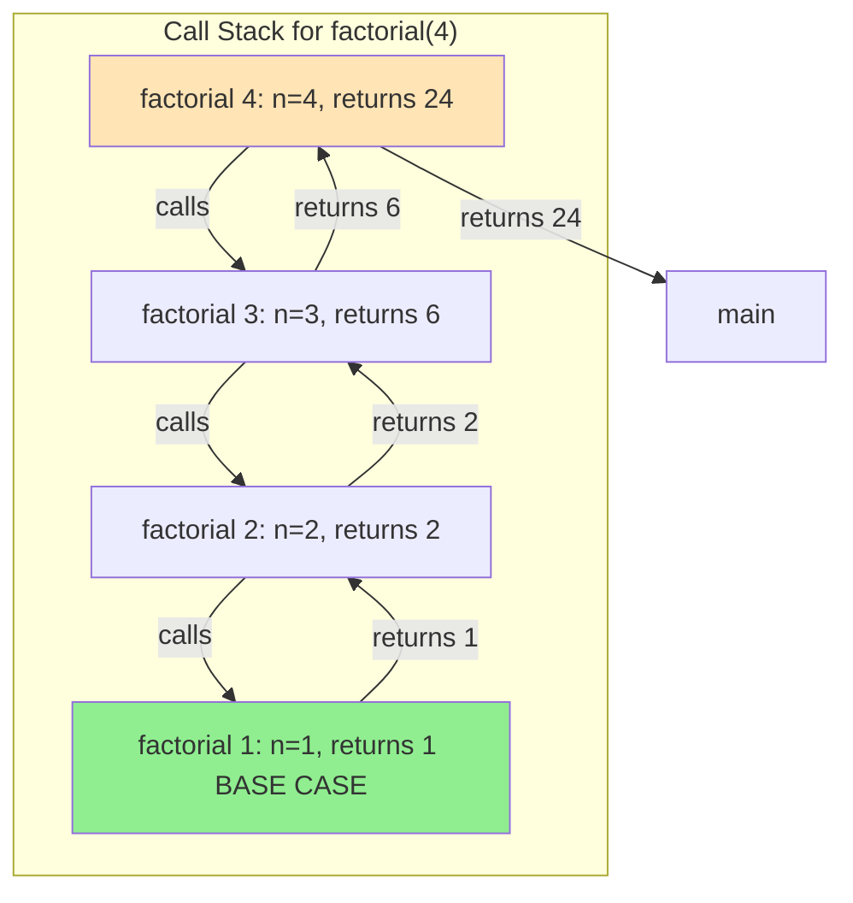
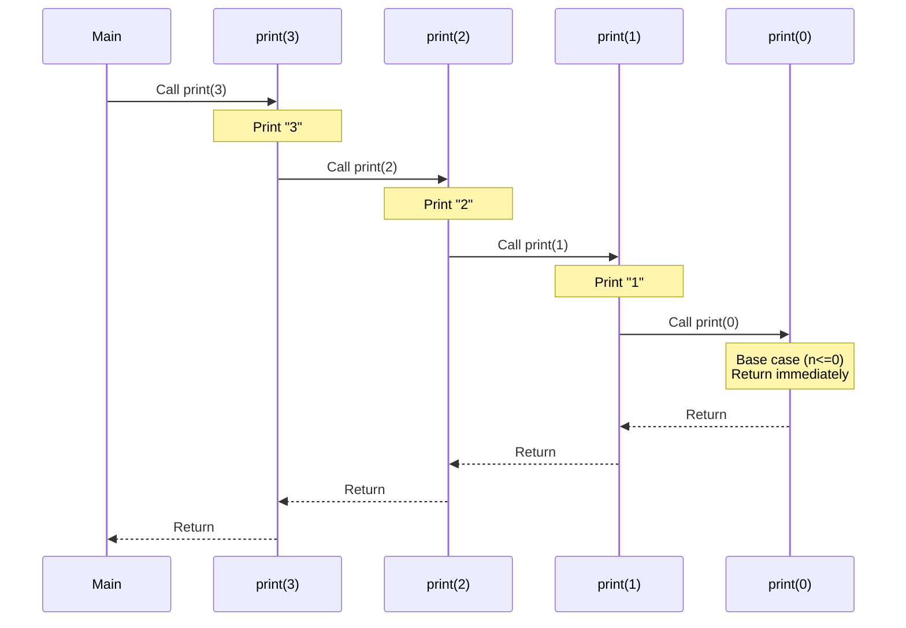

# Chapter 2: Recursion Fundamentals

## 1. What is Recursion?

**Recursion** is a programming technique where a function calls itself to solve a problem by breaking it down into smaller, similar subproblems.

### Core Principle:
Instead of solving a big problem directly, recursion says: "If I can solve a smaller version of this problem, I can use that solution to solve the bigger problem."

### Mathematical Example:
To calculate 5! (factorial of 5):
- 5! = 5 × 4!
- 4! = 4 × 3!
- 3! = 3 × 2!
- 2! = 2 × 1!
- 1! = 1 (base case)

Notice how each problem depends on solving a **smaller instance** of the same problem.

### Formal Definition:
A recursive function has two essential components:
1. **Base Case**: The condition that stops the recursion (prevents infinite loops)
2. **Recursive Case**: The function calling itself with a modified input (moving toward base case)

### Simple Analogy:
Imagine you're in line at a concert and want to know your position. You could:
- **Iterative approach**: Count everyone from the front
- **Recursive approach**: Ask the person in front of you for their position, then add 1

In recursion, each person only needs to solve a simpler version (ask the person ahead), and the solution bubbles back up.

---

## 2. Base Case and Recursive Case

Every recursive function **must have both** to work correctly.

### Base Case
The **stopping condition** that prevents infinite recursion. It's the simplest version of the problem that can be solved directly without further recursion.

**Characteristics:**
- No recursive call is made
- Returns a direct answer
- Should always be reachable
- Usually handles edge cases (empty, zero, null, etc.)

### Recursive Case
The part where the function calls itself with a **modified input** that moves toward the base case.

**Characteristics:**
- Contains the recursive call
- Input should be "smaller" or "simpler" than current input
- Must eventually reach the base case
- Combines recursive result with current step

### Example: Countdown

```cpp
#include <iostream>
using namespace std;

void countdown(int n) {
    // BASE CASE: Stop when we reach 0
    if (n <= 0) {
        cout << "Blastoff!" << endl;
        return;
    }
    
    // RECURSIVE CASE: Print current number and recurse with n-1
    cout << n << " ";
    countdown(n - 1);  // Moving toward base case
}

int main() {
    countdown(5);  // Output: 5 4 3 2 1 Blastoff!
    return 0;
}
```

**Flow Analysis:**
```
countdown(5) → prints "5", calls countdown(4)
  countdown(4) → prints "4", calls countdown(3)
    countdown(3) → prints "3", calls countdown(2)
      countdown(2) → prints "2", calls countdown(1)
        countdown(1) → prints "1", calls countdown(0)
          countdown(0) → prints "Blastoff!", RETURNS
```

### Multiple Base Cases Example:

```cpp
int fibonacci(int n) {
    // BASE CASE 1: First Fibonacci number
    if (n == 0) return 0;
    
    // BASE CASE 2: Second Fibonacci number
    if (n == 1) return 1;
    
    // RECURSIVE CASE: Sum of previous two
    return fibonacci(n - 1) + fibonacci(n - 2);
}
```

**Key Insight**: Always identify your base case(s) first when designing recursive solutions. Ask yourself: "What's the simplest input where I know the answer immediately?"

---

## 3. Recursion vs Iteration

Both recursion and iteration can solve the same problems, but they have different characteristics.

### Side-by-Side Comparison

**Problem**: Calculate the sum of numbers from 1 to n

**Iterative Solution:**
```cpp
int sumIterative(int n) {
    int sum = 0;
    for (int i = 1; i <= n; i++) {
        sum += i;
    }
    return sum;
}
// Space: O(1) - only uses sum and i variables
// Time: O(n) - loop runs n times
```

**Recursive Solution:**
```cpp
int sumRecursive(int n) {
    if (n <= 0) return 0;           // Base case
    return n + sumRecursive(n - 1); // Recursive case
}
// Space: O(n) - n function calls on stack
// Time: O(n) - n recursive calls
```

### Comparison Table

| Aspect | Recursion | Iteration |
|--------|-----------|-----------|
| **Definition** | Function calls itself | Loop repeats statements |
| **Termination** | Base case | Loop condition becomes false |
| **Space Complexity** | Higher (call stack) | Lower (few variables) |
| **Speed** | Slower (function call overhead) | Faster (direct execution) |
| **Code Clarity** | Often cleaner for tree/graph problems | Better for simple sequential tasks |
| **Stack Overflow Risk** | Yes (deep recursion) | No |
| **Best For** | Tree traversal, divide & conquer, backtracking | Simple loops, counters, iterations |

### When Recursion Shines:

```cpp
// Tree traversal - naturally recursive
struct TreeNode {
    int val;
    TreeNode *left, *right;
};

// Recursive (elegant)
void inorderTraversal(TreeNode* root) {
    if (!root) return;              // Base case
    inorderTraversal(root->left);   // Traverse left
    cout << root->val << " ";       // Process node
    inorderTraversal(root->right);  // Traverse right
}

// Iterative equivalent requires explicit stack (more complex)
```

### When Iteration Shines:

```cpp
// Simple counting - iteration is clearer
void printNumbers(int n) {
    for (int i = 1; i <= n; i++) {
        cout << i << " ";
    }
}
```

### Converting Recursion to Iteration:

Any recursive algorithm can be converted to iterative using an explicit stack, but it may lose clarity.

```cpp
// Factorial - Recursive
int factorialRec(int n) {
    if (n <= 1) return 1;
    return n * factorialRec(n - 1);
}

// Factorial - Iterative (more efficient)
int factorialIter(int n) {
    int result = 1;
    for (int i = 2; i <= n; i++) {
        result *= i;
    }
    return result;
}
```

**Guideline**: Use recursion when the problem has a **recursive structure** (trees, graphs, divide-and-conquer). Use iteration for **simple sequential processing**.

---

## 4. Call Stack Explanation

Understanding the **call stack** is crucial to mastering recursion.

### What is the Call Stack?

The **call stack** is a memory structure that stores information about active function calls. It follows **LIFO** (Last In, First Out) principle—like a stack of plates.

**Each function call creates a stack frame containing:**
- Function parameters
- Local variables
- Return address (where to resume after function completes)

### Visualizing the Call Stack



### Step-by-Step Example: factorial(4)

```cpp
int factorial(int n) {
    if (n <= 1) return 1;
    return n * factorial(n - 1);
}
```

**Execution Flow:**

**PUSH Phase (Going Down):**
```
1. factorial(4) called
   Stack: [factorial(4)]
   Waiting for factorial(3)

2. factorial(3) called
   Stack: [factorial(4), factorial(3)]
   Waiting for factorial(2)

3. factorial(2) called
   Stack: [factorial(4), factorial(3), factorial(2)]
   Waiting for factorial(1)

4. factorial(1) called
   Stack: [factorial(4), factorial(3), factorial(2), factorial(1)]
   Base case! Returns 1
```

**POP Phase (Coming Back Up):**
```
5. factorial(1) returns 1
   Stack: [factorial(4), factorial(3), factorial(2)]
   factorial(2) computes: 2 * 1 = 2

6. factorial(2) returns 2
   Stack: [factorial(4), factorial(3)]
   factorial(3) computes: 3 * 2 = 6

7. factorial(3) returns 6
   Stack: [factorial(4)]
   factorial(4) computes: 4 * 6 = 24

8. factorial(4) returns 24
   Stack: []
   Done!
```

### Detailed Call Stack Visualization for Print N to 1



### Stack Overflow

**What causes it?**
- Missing or unreachable base case
- Recursion depth exceeds stack limit (usually ~10,000 calls)

```cpp
// DANGER: Infinite recursion - stack overflow!
int badFunction(int n) {
    return badFunction(n - 1);  // No base case!
}

// Also bad: Base case never reached
int alsoBad(int n) {
    if (n == 0) return 0;
    return alsoBad(n + 1);  // Moving AWAY from base case!
}
```

**Prevention:**
- Always have a base case
- Ensure recursion moves toward base case
- Consider iterative solution for deep recursion

### Memory Impact

```cpp
void deepRecursion(int n) {
    if (n <= 0) return;
    int largeArray[1000];  // Each call allocates 4KB
    deepRecursion(n - 1);
}
// With n = 10000: 40MB of stack space!
// Likely to cause stack overflow
```

**Key Takeaway**: Every recursive call adds a frame to the stack. Deep recursion can exhaust stack memory even if the algorithm is correct.

---

## 5. When to Use Recursion

Recursion is a powerful tool, but it's not always the best choice. Here's when to reach for it:

### ✅ Use Recursion When:

**1. Problem Has Recursive Structure**
- Trees and graphs (traversal, searching)
- Divide and conquer algorithms (merge sort, quick sort, binary search)
- Backtracking problems (permutations, N-queens, Sudoku)

**2. Problem Naturally Divides Into Subproblems**
- Each subproblem is a smaller version of the original
- Solution combines results from subproblems
- Examples: Fibonacci, Tower of Hanoi, subset generation

**3. Code Clarity Improves Significantly**
- Recursive solution is much simpler to understand and maintain
- Iterative version would require complex state management

**4. Working With Recursive Data Structures**
- Linked lists (when you need to process entire list)
- Trees (almost always recursive)
- Graphs (DFS is naturally recursive)

### ❌ Avoid Recursion When:

**1. Simple Sequential Processing**
```cpp
// Don't use recursion for this
int sumRecursive(int n) {
    if (n <= 0) return 0;
    return n + sumRecursive(n - 1);
}

// Simple loop is better
int sumIterative(int n) {
    int sum = 0;
    for (int i = 1; i <= n; i++) sum += i;
    return sum;
}
```

**2. Deep Recursion Expected**
- If recursion depth could exceed ~5000-10000
- Risk of stack overflow
- Use iteration or tail recursion optimization

**3. Performance is Critical**
- Recursion has overhead (function calls, stack frames)
- Iteration is faster for simple problems

**4. Overlapping Subproblems Without Memoization**
```cpp
// Naive Fibonacci - TERRIBLE performance
int fib(int n) {
    if (n <= 1) return n;
    return fib(n-1) + fib(n-2);  // Recalculates same values many times!
}
// fib(5) calls fib(3) twice, fib(2) three times, etc.
// Time: O(2^n) - exponential!
```

### Decision Framework:

**Ask yourself:**
1. Is the problem naturally recursive? (trees, divide-and-conquer)
2. Will recursion make the code significantly clearer?
3. Is the recursion depth reasonable (< 5000)?
4. Are there overlapping subproblems? (If yes, use memoization)
5. Is performance critical? (If yes, consider iteration)

### Real-World Use Cases:

**Perfect for Recursion:**
- File system traversal (directories contain subdirectories)
- JSON/XML parsing (nested structures)
- Compiler/interpreter design (expression evaluation)
- Game AI (minimax algorithm)
- Mathematical sequences (Fibonacci, factorials)

**Better with Iteration:**
- Processing arrays sequentially
- Simple counting and summation
- Reading files line by line
- Database pagination

---

## Real-Life Examples

### 1. Russian Dolls (Matryoshka)

Imagine a set of Russian nesting dolls. To find the smallest doll:

**Recursive Thinking:**
1. **Base Case**: If the current doll doesn't contain another doll, you've found the smallest
2. **Recursive Case**: Open the current doll and find the smallest doll inside it

```cpp
struct Doll {
    string name;
    Doll* innerDoll;  // nullptr if no inner doll
};

string findSmallestDoll(Doll* currentDoll) {
    // Base case: This doll has no inner doll
    if (currentDoll->innerDoll == nullptr) {
        return currentDoll->name;
    }
    
    // Recursive case: Check the inner doll
    return findSmallestDoll(currentDoll->innerDoll);
}

int main() {
    // Creating nested dolls: Large -> Medium -> Small
    Doll small = {"Small Doll", nullptr};
    Doll medium = {"Medium Doll", &small};
    Doll large = {"Large Doll", &medium};
    
    cout << "Smallest: " << findSmallestDoll(&large) << endl;
    // Output: Smallest: Small Doll
    return 0;
}
```

**Why Recursion Works Here:**
Each doll contains a smaller version of the same problem (finding the smallest doll), making recursion natural.

### 2. File System Traversal

Your computer's file system is inherently recursive: folders contain files and other folders, which contain more files and folders, and so on.

**Problem**: Calculate total size of all files in a directory (including subdirectories)

**Recursive Approach:**
```cpp
#include <iostream>
#include <vector>
#include <string>
using namespace std;

struct File {
    string name;
    int size;  // in bytes
};

struct Directory {
    string name;
    vector<File> files;
    vector<Directory*> subdirectories;
};

// Calculate total size recursively
long long calculateTotalSize(Directory* dir) {
    // Base case would be handled by empty vectors
    long long totalSize = 0;
    
    // Add size of all files in current directory
    for (const File& file : dir->files) {
        totalSize += file.size;
    }
    
    // Recursive case: Add size of all subdirectories
    for (Directory* subdir : dir->subdirectories) {
        totalSize += calculateTotalSize(subdir);  // Recursion!
    }
    
    return totalSize;
}

// Print directory structure with indentation
void printDirectoryStructure(Directory* dir, int depth = 0) {
    string indent(depth * 2, ' ');
    
    cout << indent << dir->name << "/" << endl;
    
    // Print files
    for (const File& file : dir->files) {
        cout << indent << "  " << file.name << " (" << file.size << " bytes)" << endl;
    }
    
    // Recursively print subdirectories
    for (Directory* subdir : dir->subdirectories) {
        printDirectoryStructure(subdir, depth + 1);
    }
}

int main() {
    // Create a file system structure
    Directory projects;
    projects.name = "Projects";
    projects.files = {{"README.md", 1024}, {"config.json", 512}};
    
    Directory webApp;
    webApp.name = "WebApp";
    webApp.files = {{"index.html", 2048}, {"style.css", 1536}};
    
    Directory backend;
    backend.name = "Backend";
    backend.files = {{"server.cpp", 4096}, {"database.cpp", 3072}};
    
    webApp.subdirectories.push_back(&backend);
    projects.subdirectories.push_back(&webApp);
    
    // Print structure
    cout << "Directory Structure:" << endl;
    printDirectoryStructure(&projects);
    
    // Calculate total size
    cout << "\nTotal size: " << calculateTotalSize(&projects) << " bytes" << endl;
    
    return 0;
}
```

**Output:**
```
Directory Structure:
Projects/
  README.md (1024 bytes)
  config.json (512 bytes)
  WebApp/
    index.html (2048 bytes)
    style.css (1536 bytes)
    Backend/
      server.cpp (4096 bytes)
      database.cpp (3072 bytes)

Total size: 12288 bytes
```

**Why Recursion is Perfect Here:**
- File systems are naturally recursive (folders within folders)
- Each subdirectory is the same type of problem
- We don't know the depth in advance
- Iterative solution would require maintaining a complex stack

**Real-World Applications:**
- `ls -R` command on Linux/Mac
- File search utilities
- Disk usage analyzers
- Backup software
- Code indexing tools

---

## Code Examples

### Example 1: Factorial

**Problem**: Calculate n! = n × (n-1) × (n-2) × ... × 1

```cpp
#include <iostream>
using namespace std;

// Recursive factorial
long long factorial(int n) {
    // Base case: 0! = 1 and 1! = 1
    if (n <= 1) {
        return 1;
    }
    
    // Recursive case: n! = n × (n-1)!
    return n * factorial(n - 1);
}

int main() {
    int n = 5;
    cout << n << "! = " << factorial(n) << endl;  // Output: 5! = 120
    
    // Show the recursion flow
    cout << "\nRecursion breakdown for factorial(5):" << endl;
    cout << "factorial(5) = 5 * factorial(4)" << endl;
    cout << "factorial(4) = 4 * factorial(3)" << endl;
    cout << "factorial(3) = 3 * factorial(2)" << endl;
    cout << "factorial(2) = 2 * factorial(1)" << endl;
    cout << "factorial(1) = 1 (base case)" << endl;
    cout << "\nReturning back:" << endl;
    cout << "factorial(2) = 2 * 1 = 2" << endl;
    cout << "factorial(3) = 3 * 2 = 6" << endl;
    cout << "factorial(4) = 4 * 6 = 24" << endl;
    cout << "factorial(5) = 5 * 24 = 120" << endl;
    
    return 0;
}
```

**Trace for factorial(5):**
```
factorial(5)
├─ 5 * factorial(4)
   ├─ 4 * factorial(3)
      ├─ 3 * factorial(2)
         ├─ 2 * factorial(1)
            └─ 1 (base case)
         └─ returns 2
      └─ returns 6
   └─ returns 24
└─ returns 120
```

---

### Example 2: Fibonacci Sequence

**Problem**: Calculate nth Fibonacci number where F(0)=0, F(1)=1, F(n)=F(n-1)+F(n-2)

```cpp
#include <iostream>
using namespace std;

// Naive recursive Fibonacci - INEFFICIENT
int fibonacciNaive(int n) {
    // Base cases
    if (n == 0) return 0;
    if (n == 1) return 1;
    
    // Recursive case
    return fibonacciNaive(n - 1) + fibonacciNaive(n - 2);
}

// Optimized with memoization (cache results)
int fibonacciMemo(int n, int memo[]) {
    // Base cases
    if (n == 0) return 0;
    if (n == 1) return 1;
    
    // Check if already calculated
    if (memo[n] != -1) {
        return memo[n];
    }
    
    // Calculate and store in memo
    memo[n] = fibonacciMemo(n - 1, memo) + fibonacciMemo(n - 2, memo);
    return memo[n];
}

int main() {
    int n = 10;
    
    // Naive approach
    cout << "Fibonacci(" << n << ") = " << fibonacciNaive(n) << endl;
    
    // Optimized approach
    int memo[100];
    for (int i = 0; i < 100; i++) memo[i] = -1;  // Initialize with -1
    cout << "Fibonacci(" << n << ") with memo = " << fibonacciMemo(n, memo) << endl;
    
    // Show first 10 Fibonacci numbers
    cout << "\nFirst 10 Fibonacci numbers: ";
    for (int i = 0; i < 10; i++) {
        cout << fibonacciNaive(i) << " ";
    }
    cout << endl;
    
    return 0;
}
```

**Why Naive Fibonacci is Inefficient:**
```
fib(5) calls:
├─ fib(4)
│  ├─ fib(3)
│  │  ├─ fib(2)
│  │  │  ├─ fib(1) ✓
│  │  │  └─ fib(0) ✓
│  │  └─ fib(1) ✓
│  └─ fib(2)      ← RECALCULATED!
│     ├─ fib(1) ✓
│     └─ fib(0) ✓
└─ fib(3)         ← RECALCULATED!
   ├─ fib(2)      ← RECALCULATED!
   │  ├─ fib(1) ✓
   │  └─ fib(0) ✓
   └─ fib(1) ✓
```

**Time Complexity:**
- Naive: O(2^n) - exponential! fib(40) takes seconds
- Memoized: O(n) - each value calculated once

---

### Example 3: Print Numbers in Different Orders

```cpp
#include <iostream>
using namespace std;

// Print numbers from n down to 1
void printDescending(int n) {
    if (n <= 0) return;  // Base case
    
    cout << n << " ";        // Print BEFORE recursive call
    printDescending(n - 1);  // Recursive call
}

// Print numbers from 1 up to n
void printAscending(int n) {
    if (n <= 0) return;  // Base case
    
    printAscending(n - 1);  // Recursive call FIRST
    cout << n << " ";       // Print AFTER recursive call
}

// Print both ways
void printBoth(int n) {
    if (n <= 0) return;
    
    cout << n << " ";       // Print on the way down
    printBoth(n - 1);
    cout << n << " ";       // Print on the way up
}

int main() {
    int n = 5;
    
    cout << "Descending (5 to 1): ";
    printDescending(n);  // Output: 5 4 3 2 1
    
    cout << "\nAscending (1 to 5): ";
    printAscending(n);   // Output: 1 2 3 4 5
    
    cout << "\nBoth ways: ";
    printBoth(n);        // Output: 5 4 3 2 1 1 2 3 4 5
    
    cout << endl;
    return 0;
}
```

**Key Insight:**
- Printing **before** recursion: Descending order
- Printing **after** recursion: Ascending order
- The **position** of the print statement relative to the recursive call determines the order!

---

### Example 4: Sum of Array Elements

```cpp
#include <iostream>
using namespace std;

// Recursive sum of array
int sumArray(int arr[], int n) {
    // Base case: empty array
    if (n <= 0) {
        return 0;
    }
    
    // Recursive case: last element + sum of rest
    return arr[n - 1] + sumArray(arr, n - 1);
}

// Alternative: start from beginning
int sumArrayFromStart(int arr[], int start, int end) {
    // Base case: no elements
    if (start > end) {
        return 0;
    }
    
    // Recursive case: first element + sum of rest
    return arr[start] + sumArrayFromStart(arr, start + 1, end);
}

int main() {
    int arr[] = {1, 2, 3, 4, 5};
    int n = 5;
    
    cout << "Sum (from end): " << sumArray(arr, n) << endl;
    cout << "Sum (from start): " << sumArrayFromStart(arr, 0, n - 1) << endl;
    
    return 0;
}
```

---

### Example 5: Power Function

```cpp
#include <iostream>
using namespace std;

// Calculate base^exponent
long long power(int base, int exponent) {
    // Base case: anything^0 = 1
    if (exponent == 0) {
        return 1;
    }
    
    // Recursive case: base * base^(exponent-1)
    return base * power(base, exponent - 1);
}

// Optimized version using divide and conquer
long long powerOptimized(int base, int exponent) {
    if (exponent == 0) return 1;
    
    // If exponent is even: base^n = (base^(n/2))^2
    if (exponent % 2 == 0) {
        long long half = powerOptimized(base, exponent / 2);
        return half * half;
    }
    // If exponent is odd: base^n = base * base^(n-1)
    else {
        return base * powerOptimized(base, exponent - 1);
    }
}

int main() {
    int base = 2, exponent = 10;
    
    cout << base << "^" << exponent << " = " << power(base, exponent) << endl;
    cout << base << "^" << exponent << " (optimized) = " << powerOptimized(base, exponent) << endl;
    
    return 0;
}
```

**Optimization Explanation:**
- Naive: 2^10 = 2 × 2^9 → 10 multiplications
- Optimized: 2^10 = (2^5)^2 = (2 × 2^4)^2 = (2 × (2^2)^2)^2 → ~5 multiplications

**Time Complexity:**
- Naive: O(n)
- Optimized: O(log n)

---

## Time & Space Analysis of Recursive Algorithms

Understanding the complexity of recursive algorithms is crucial for writing efficient code.

### Time Complexity Analysis

**Method 1: Count Total Operations**

For simple recursion, count how many times the function is called.

```cpp
int factorial(int n) {
    if (n <= 1) return 1;
    return n * factorial(n - 1);
}
```
- Makes n recursive calls
- Each call does O(1) work
- **Time: O(n)**

---

**Method 2: Recurrence Relations**

For complex recursion, write a recurrence relation and solve it.

```cpp
int fibonacci(int n) {
    if (n <= 1) return n;
    return fibonacci(n - 1) + fibonacci(n - 2);
}
```

**Recurrence:** T(n) = T(n-1) + T(n-2) + O(1)

This grows exponentially!
- **Time: O(2^n)** - extremely slow
- For n=30, makes ~1 billion calls!

---

**Method 3: Recursion Tree**

Draw a tree showing all recursive calls.

**Binary Search:**
```cpp
int binarySearch(int arr[], int left, int right, int target) {
    if (left > right) return -1;
    
    int mid = left + (right - left) / 2;
    if (arr[mid] == target) return mid;
    
    if (arr[mid] > target)
        return binarySearch(arr, left, mid - 1, target);
    else
        return binarySearch(arr, mid + 1, right, target);
}
```

**Recursion Tree:**
```
Level 0: 1 call (n elements)
Level 1: 1 call (n/2 elements)
Level 2: 1 call (n/4 elements)
...
Level k: 1 call (1 element)
```

Tree height = log₂(n), total calls = log₂(n)
- **Time: O(log n)**

---

**Method 4: Master Theorem (Divide & Conquer)**

For recurrences of the form: T(n) = aT(n/b) + f(n)

**Merge Sort:**
```cpp
void mergeSort(int arr[], int left, int right) {
    if (left >= right) return;
    
    int mid = left + (right - left) / 2;
    mergeSort(arr, left, mid);        // T(n/2)
    mergeSort(arr, mid + 1, right);   // T(n/2)
    merge(arr, left, mid, right);     // O(n)
}
```

**Recurrence:** T(n) = 2T(n/2) + O(n)
- a = 2 (two recursive calls)
- b = 2 (divide by 2)
- f(n) = O(n) (merge work)

**Time: O(n log n)**

---

### Space Complexity Analysis

Space complexity includes:
1. **Call stack space** (function calls)
2. **Auxiliary space** (extra data structures)

**Linear Recursion:**
```cpp
int factorial(int n) {
    if (n <= 1) return 1;
    return n * factorial(n - 1);
}
```
- Maximum stack depth: n
- Each frame uses O(1) space
- **Space: O(n)**

---

**Binary Tree Recursion:**
```cpp
int treeHeight(TreeNode* root) {
    if (!root) return 0;
    return 1 + max(treeHeight(root->left), treeHeight(root->right));
}
```
- Maximum stack depth: height of tree
- For balanced tree: O(log n)
- For skewed tree: O(n)
- **Space: O(h)** where h = tree height

---

**Fibonacci (Naive):**
```cpp
int fib(int n) {
    if (n <= 1) return n;
    return fib(n-1) + fib(n-2);
}
```
- Although total calls = O(2^n), **maximum stack depth = n**
- **Space: O(n)** (not 2^n!)
- Calls complete and pop off stack before others start

---

**With Memoization:**
```cpp
int fibMemo(int n, int memo[]) {
    if (n <= 1) return n;
    if (memo[n] != -1) return memo[n];
    memo[n] = fibMemo(n-1, memo) + fibMemo(n-2, memo);
    return memo[n];
}
```
- Stack depth: O(n)
- Memo array: O(n)
- **Space: O(n)**
- **Time: O(n)** - huge improvement from O(2^n)!

---

### Complexity Summary Table

| Algorithm | Recurrence | Time | Space | Notes |
|-----------|-----------|------|-------|-------|
| **Factorial** | T(n) = T(n-1) + O(1) | O(n) | O(n) | Linear recursion |
| **Fibonacci (naive)** | T(n) = T(n-1) + T(n-2) | O(2^n) | O(n) | Exponential - avoid! |
| **Fibonacci (memo)** | T(n) = O(1) cached | O(n) | O(n) | Much better |
| **Binary Search** | T(n) = T(n/2) + O(1) | O(log n) | O(log n) | Divide by 2 each time |
| **Merge Sort** | T(n) = 2T(n/2) + O(n) | O(n log n) | O(n) | Best sorting |
| **Tree Height** | T(n) = 2T(n/2) + O(1) | O(n) | O(h) | h = tree height |
| **Power (naive)** | T(n) = T(n-1) + O(1) | O(n) | O(n) | Linear |
| **Power (optimized)** | T(n) = T(n/2) + O(1) | O(log n) | O(log n) | Divide and conquer |

---

## Common Recursion Mistakes

### 1. ❌ Missing Base Case

```cpp
// WRONG: Infinite recursion!
int countdown(int n) {
    cout << n << " ";
    countdown(n - 1);  // No base case - stack overflow!
}

// CORRECT:
int countdown(int n) {
    if (n <= 0) return;  // Base case
    cout << n << " ";
    countdown(n - 1);
}
```

**Error:** Program crashes with stack overflow.

---

### 2. ❌ Base Case Never Reached

```cpp
// WRONG: Moving away from base case
int sumToZero(int n) {
    if (n == 0) return 0;      // Base case is 0
    return n + sumToZero(n + 1);  // But we're INCREASING n!
}

// CORRECT:
int sumToZero(int n) {
    if (n == 0) return 0;
    return n + sumToZero(n - 1);  // Moving TOWARD base case
}
```

**Key Principle:** Each recursive call must move **closer to the base case**.

---

### 3. ❌ Modifying Original Data Incorrectly

```cpp
// WRONG: Passing by value when you need reference
void reverseArray(int arr[], int start, int end) {
    if (start >= end) return;
    swap(arr[start], arr[end]);  // This works
    reverseArray(arr, start + 1, end - 1);
}

// But this doesn't work for vectors without reference:
void reverseVector(vector<int> v, int start, int end) {  // Copy made!
    if (start >= end) return;
    swap(v[start], v[end]);  // Modifies COPY, not original
    reverseVector(v, start + 1, end - 1);
}

// CORRECT:
void reverseVector(vector<int>& v, int start, int end) {  // Reference!
    if (start >= end) return;
    swap(v[start], v[end]);
    reverseVector(v, start + 1, end - 1);
}
```

---

### 4. ❌ Not Handling Edge Cases

```cpp
// WRONG: Doesn't handle negative numbers
int factorial(int n) {
    if (n == 0) return 1;
    return n * factorial(n - 1);  // What if n is negative?
}

// CORRECT:
int factorial(int n) {
    if (n < 0) return -1;     // Error case
    if (n <= 1) return 1;     // Base case covers 0 and 1
    return n * factorial(n - 1);
}
```

**Always consider:**
- Negative numbers
- Zero
- Empty arrays/lists
- Null pointers

---

### 5. ❌ Inefficient Recursion (Overlapping Subproblems)

```cpp
// WRONG: Recalculates same values repeatedly
int fibonacci(int n) {
    if (n <= 1) return n;
    return fibonacci(n-1) + fibonacci(n-2);  // O(2^n) - terrible!
}

// CORRECT: Use memoization
int fibMemo(int n, vector<int>& memo) {
    if (n <= 1) return n;
    if (memo[n] != -1) return memo[n];
    memo[n] = fibMemo(n-1, memo) + fibMemo(n-2, memo);
    return memo[n];
}
```

---

### 6. ❌ Integer Overflow

```cpp
// WRONG: Factorial of 20 exceeds int range
int factorial(int n) {
    if (n <= 1) return 1;
    return n * factorial(n - 1);  // Overflow for n > 12!
}

// CORRECT: Use long long
long long factorial(int n) {
    if (n <= 1) return 1;
    return (long long)n * factorial(n - 1);
}
```

---

### 7. ❌ Not Returning the Recursive Call

```cpp
// WRONG: Missing return
int search(int arr[], int n, int target) {
    if (n == 0) return -1;
    if (arr[n-1] == target) return n-1;
    search(arr, n-1, target);  // FORGOT return!
}

// CORRECT:
int search(int arr[], int n, int target) {
    if (n == 0) return -1;
    if (arr[n-1] == target) return n-1;
    return search(arr, n-1, target);  // Return the result!
}
```

---

### 8. ❌ Wrong Base Case Logic

```cpp
// WRONG: Off-by-one error
int sumToN(int n) {
    if (n == 1) return 1;  // What about n=0?
    return n + sumToN(n - 1);
}
// Calling sumToN(0) causes infinite recursion!

// CORRECT:
int sumToN(int n) {
    if (n <= 0) return 0;  // Handles 0 and negative
    return n + sumToN(n - 1);
}
```

---

### 9. ❌ Unnecessary Multiple Base Cases

```cpp
// WRONG: Redundant base cases
int fibonacci(int n) {
    if (n == 0) return 0;
    if (n == 1) return 1;
    if (n == 2) return 1;  // Unnecessary!
    return fibonacci(n-1) + fibonacci(n-2);
}

// CORRECT:
int fibonacci(int n) {
    if (n <= 1) return n;  // Handles both 0 and 1
    return fibonacci(n-1) + fibonacci(n-2);
}
```

---

### 10. ❌ Confusing Pre-order vs Post-order Processing

```cpp
// Different results based on WHEN you process
void printDescending(int n) {
    if (n <= 0) return;
    cout << n << " ";       // Process BEFORE recursion
    printDescending(n-1);
}
// Output: 5 4 3 2 1

void printAscending(int n) {
    if (n <= 0) return;
    printAscending(n-1);
    cout << n << " ";       // Process AFTER recursion
}
// Output: 1 2 3 4 5
```

**Rule:** 
- Print/process **before** recursion → Descending order
- Print/process **after** recursion → Ascending order

---

## LeetCode Practice Problems

### Easy Level (Foundation Building)

1. **[Pow(x, n)](https://leetcode.com/problems/powx-n/)** - Implement power function recursively
   - **Key Concept:** Divide and conquer, handle negative exponents
   - **Complexity:** O(log n)

2. **[Fibonacci Number](https://leetcode.com/problems/fibonacci-number/)** - Classic recursion problem
   - **Key Concept:** Base cases, memoization optimization
   - **Complexity:** O(2^n) naive, O(n) with memo

3. **[Climbing Stairs](https://leetcode.com/problems/climbing-stairs/)** - Similar to Fibonacci
   - **Key Concept:** Recognizing recursive patterns
   - **Complexity:** O(n) with memoization

4. **[Reverse String](https://leetcode.com/problems/reverse-string/)** - Two-pointer recursion
   - **Key Concept:** In-place modification, base case with indices
   - **Complexity:** O(n)

5. **[Palindrome Linked List](https://leetcode.com/problems/palindrome-linked-list/)** - Recursive traversal
   - **Key Concept:** Using call stack for comparison
   - **Complexity:** O(n)

---

### Medium Level (Pattern Recognition)

6. **[Generate Parentheses](https://leetcode.com/problems/generate-parentheses/)** - Backtracking
   - **Key Concept:** Decision tree, valid state tracking
   - **Complexity:** O(4^n / √n)

7. **[Subsets](https://leetcode.com/problems/subsets/)** - Backtracking, power set
   - **Key Concept:** Include/exclude decision for each element
   - **Complexity:** O(2^n)

8. **[Permutations](https://leetcode.com/problems/permutations/)** - All arrangements
   - **Key Concept:** Backtracking with swapping
   - **Complexity:** O(n!)

9. **[Letter Combinations of a Phone Number](https://leetcode.com/problems/letter-combinations-of-a-phone-number/)** - Backtracking
   - **Key Concept:** Multiple choices at each step
   - **Complexity:** O(4^n) worst case

10. **[Combination Sum](https://leetcode.com/problems/combination-sum/)** - Backtracking with pruning
    - **Key Concept:** Reusing elements, early termination
    - **Complexity:** O(2^n)

---

### Medium+ Level (Tree & Graph Recursion)

11. **[Binary Tree Inorder Traversal](https://leetcode.com/problems/binary-tree-inorder-traversal/)** - Tree traversal
    - **Key Concept:** Left-Root-Right pattern
    - **Complexity:** O(n)

12. **[Maximum Depth of Binary Tree](https://leetcode.com/problems/maximum-depth-of-binary-tree/)** - Tree height
    - **Key Concept:** Max of left and right subtrees
    - **Complexity:** O(n)

13. **[Merge Two Sorted Lists](https://leetcode.com/problems/merge-two-sorted-lists/)** - List recursion
    - **Key Concept:** Compare and recurse
    - **Complexity:** O(m + n)

14. **[Reverse Linked List](https://leetcode.com/problems/reverse-linked-list/)** - Pointer manipulation
    - **Key Concept:** Recursive vs iterative approaches
    - **Complexity:** O(n)

15. **[Kth Symbol in Grammar](https://leetcode.com/problems/k-th-symbol-in-grammar/)** - Pattern recognition
    - **Key Concept:** Finding recursive structure in patterns
    - **Complexity:** O(log n)

---

### Advanced Medium (Divide & Conquer)

16. **[Sort an Array](https://leetcode.com/problems/sort-an-array/)** - Merge sort implementation
    - **Key Concept:** Divide and conquer sorting
    - **Complexity:** O(n log n)

17. **[Different Ways to Add Parentheses](https://leetcode.com/problems/different-ways-to-add-parentheses/)** - Expression evaluation
    - **Key Concept:** Divide on operators
    - **Complexity:** Catalan number complexity

18. **[Beautiful Arrangement](https://leetcode.com/problems/beautiful-arrangement/)** - Backtracking with pruning
    - **Key Concept:** Early termination for invalid states
    - **Complexity:** O(k) where k is # of valid permutations

---

### Practice Strategy

**Week 1-2:** Easy problems (1-5)
- Master base cases and simple recursion
- Practice tracing recursion manually
- Implement both recursive and iterative solutions

**Week 3-4:** Medium backtracking (6-10)
- Learn backtracking pattern
- Understand decision trees
- Practice space optimization

**Week 5-6:** Tree/Graph recursion (11-15)
- Focus on tree traversals
- Master recursive data structure manipulation
- Understand recursion depth

**Week 7+:** Advanced topics (16-18)
- Divide and conquer algorithms
- Memoization and DP transition
- Optimize recursive solutions

---

## Conclusion

You've completed Chapter 2 on Recursion! You now understand:

✅ What recursion is and when to use it
✅ The critical importance of base cases and recursive cases
✅ How the call stack works and why it matters
✅ The difference between recursion and iteration
✅ Time and space complexity analysis for recursive algorithms
✅ Common mistakes and how to avoid them
✅ Real-world applications (file systems, Russian dolls)

**Key Takeaways:**
1. **Every recursive function needs a base case** - your safety net against infinite recursion
2. **Recursive calls must move toward the base case** - or you'll overflow the stack
3. **Watch out for overlapping subproblems** - use memoization to optimize from O(2^n) to O(n)
4. **Recursion excels at tree/graph problems** - its natural fit for hierarchical structures
5. **Space complexity matters** - each recursive call adds to the stack

**Coming up in Chapter 3:** Arrays and Strings - mastering the most fundamental linear data structures with advanced techniques like two-pointers, sliding window, and prefix sums.

Keep practicing! Recursion takes time to internalize, but once it "clicks," you'll see recursive patterns everywhere. 🚀
