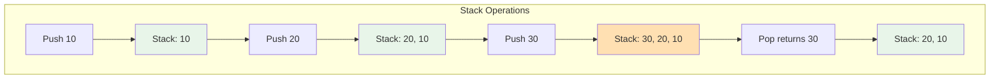
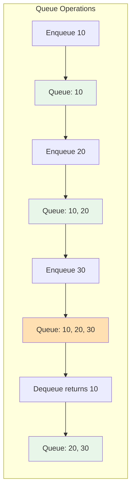

# Chapter 5: Stacks and Queues

## 1. Stack Operations

A **stack** is a linear data structure that follows the **LIFO** (Last In, First Out) principle. Think of it as a stack of plates - you can only add or remove plates from the top.

### Core Principle: LIFO (Last In, First Out)

The last element added is the first one to be removed.

```
Push 1 → Push 2 → Push 3 → Pop → Result: 3 (last in, first out)
```

### Basic Stack Operations:

| Operation | Description | Time Complexity |
|-----------|-------------|-----------------|
| **push(x)** | Add element to top | O(1) |
| **pop()** | Remove and return top element | O(1) |
| **peek() / top()** | View top element without removing | O(1) |
| **isEmpty()** | Check if stack is empty | O(1) |
| **size()** | Get number of elements | O(1) |

---

### Stack Visualization:



**Visual Representation:**
```
Initial: []          After push(10):  [10]         After push(20):  [20]
                                                                     [10]

After push(30):      After pop():     
     [30]  ← TOP          [20]  ← TOP
     [20]                 [10]
     [10]
```

---

### Stack Implementation Using Array:

```cpp
#include <iostream>
#include <stdexcept>
using namespace std;

class Stack {
private:
    int* arr;
    int topIndex;
    int capacity;
    
public:
    // Constructor
    Stack(int size = 100) {
        arr = new int[size];
        capacity = size;
        topIndex = -1;  // Empty stack
    }
    
    // Destructor
    ~Stack() {
        delete[] arr;
    }
    
    // Push element onto stack
    void push(int x) {
        if (isFull()) {
            throw overflow_error("Stack overflow! Cannot push.");
        }
        arr[++topIndex] = x;
        cout << "Pushed: " << x << endl;
    }
    
    // Pop element from stack
    int pop() {
        if (isEmpty()) {
            throw underflow_error("Stack underflow! Cannot pop.");
        }
        return arr[topIndex--];
    }
    
    // Peek at top element
    int peek() {
        if (isEmpty()) {
            throw underflow_error("Stack is empty!");
        }
        return arr[topIndex];
    }
    
    // Check if stack is empty
    bool isEmpty() {
        return topIndex == -1;
    }
    
    // Check if stack is full
    bool isFull() {
        return topIndex == capacity - 1;
    }
    
    // Get size
    int size() {
        return topIndex + 1;
    }
    
    // Display stack contents
    void display() {
        if (isEmpty()) {
            cout << "Stack is empty" << endl;
            return;
        }
        
        cout << "Stack (top to bottom): ";
        for (int i = topIndex; i >= 0; i--) {
            cout << arr[i];
            if (i > 0) cout << " -> ";
        }
        cout << endl;
    }
};

int main() {
    Stack stack(5);
    
    stack.push(10);
    stack.push(20);
    stack.push(30);
    stack.display();  // 30 -> 20 -> 10
    
    cout << "Top element: " << stack.peek() << endl;  // 30
    cout << "Size: " << stack.size() << endl;         // 3
    
    cout << "Popped: " << stack.pop() << endl;  // 30
    cout << "Popped: " << stack.pop() << endl;  // 20
    stack.display();  // 10
    
    return 0;
}
```

**Output:**
```
Pushed: 10
Pushed: 20
Pushed: 30
Stack (top to bottom): 30 -> 20 -> 10
Top element: 30
Size: 3
Popped: 30
Popped: 20
Stack (top to bottom): 10
```

---

### Stack Implementation Using Linked List:

```cpp
#include <iostream>
using namespace std;

struct Node {
    int data;
    Node* next;
    Node(int val) : data(val), next(nullptr) {}
};

class StackLinkedList {
private:
    Node* topNode;
    int count;
    
public:
    StackLinkedList() : topNode(nullptr), count(0) {}
    
    ~StackLinkedList() {
        while (!isEmpty()) {
            pop();
        }
    }
    
    void push(int x) {
        Node* newNode = new Node(x);
        newNode->next = topNode;
        topNode = newNode;
        count++;
    }
    
    int pop() {
        if (isEmpty()) {
            throw underflow_error("Stack is empty!");
        }
        
        Node* temp = topNode;
        int value = temp->data;
        topNode = topNode->next;
        delete temp;
        count--;
        return value;
    }
    
    int peek() {
        if (isEmpty()) {
            throw underflow_error("Stack is empty!");
        }
        return topNode->data;
    }
    
    bool isEmpty() {
        return topNode == nullptr;
    }
    
    int size() {
        return count;
    }
};
```

**Advantages of Linked List Implementation:**
- ✅ Dynamic size (no fixed capacity)
- ✅ No stack overflow (unless out of memory)

**Disadvantages:**
- ❌ Extra memory for pointers
- ❌ Slightly slower due to pointer dereferencing

---

## 2. Applications of Stack

### Application 1: Balanced Parentheses Checker

**Problem**: Check if brackets are balanced: `()`, `{}`, `[]`

```cpp
#include <iostream>
#include <stack>
#include <string>
using namespace std;

bool isBalanced(string expr) {
    stack<char> s;
    
    for (char ch : expr) {
        // Push opening brackets
        if (ch == '(' || ch == '{' || ch == '[') {
            s.push(ch);
        }
        // Check closing brackets
        else if (ch == ')' || ch == '}' || ch == ']') {
            if (s.empty()) return false;
            
            char top = s.top();
            s.pop();
            
            // Check if matching pair
            if ((ch == ')' && top != '(') ||
                (ch == '}' && top != '{') ||
                (ch == ']' && top != '[')) {
                return false;
            }
        }
    }
    
    return s.empty();  // All opened must be closed
}

int main() {
    cout << "({[]}) : " << (isBalanced("({[]})") ? "Balanced" : "Not Balanced") << endl;
    cout << "({[}]) : " << (isBalanced("({[}])") ? "Balanced" : "Not Balanced") << endl;
    cout << "((()) : " << (isBalanced("((())") ? "Balanced" : "Not Balanced") << endl;
    
    return 0;
}
```

**Output:**
```
({[]}) : Balanced
({[}]) : Not Balanced
((()) : Not Balanced
```

---

### Application 2: Infix to Postfix Conversion

**Infix**: `A + B * C` (operators between operands)  
**Postfix**: `A B C * +` (operators after operands)

```cpp
#include <iostream>
#include <stack>
#include <string>
using namespace std;

int precedence(char op) {
    if (op == '+' || op == '-') return 1;
    if (op == '*' || op == '/') return 2;
    if (op == '^') return 3;
    return 0;
}

string infixToPostfix(string infix) {
    stack<char> s;
    string postfix = "";
    
    for (char ch : infix) {
        // Operand: add to output
        if (isalnum(ch)) {
            postfix += ch;
        }
        // Opening parenthesis: push to stack
        else if (ch == '(') {
            s.push(ch);
        }
        // Closing parenthesis: pop until '('
        else if (ch == ')') {
            while (!s.empty() && s.top() != '(') {
                postfix += s.top();
                s.pop();
            }
            s.pop();  // Remove '('
        }
        // Operator
        else {
            while (!s.empty() && precedence(s.top()) >= precedence(ch)) {
                postfix += s.top();
                s.pop();
            }
            s.push(ch);
        }
    }
    
    // Pop remaining operators
    while (!s.empty()) {
        postfix += s.top();
        s.pop();
    }
    
    return postfix;
}

int main() {
    cout << "A+B*C = " << infixToPostfix("A+B*C") << endl;
    cout << "(A+B)*C = " << infixToPostfix("(A+B)*C") << endl;
    cout << "A+B*C-D/E = " << infixToPostfix("A+B*C-D/E") << endl;
    
    return 0;
}
```

**Output:**
```
A+B*C = ABC*+
(A+B)*C = AB+C*
A+B*C-D/E = ABC*+DE/-
```

---

### Application 3: Function Call Stack (Recursion)

Every function call is pushed onto the call stack:

```cpp
void functionC() {
    cout << "In function C" << endl;
}

void functionB() {
    cout << "In function B" << endl;
    functionC();
    cout << "Back in B" << endl;
}

void functionA() {
    cout << "In function A" << endl;
    functionB();
    cout << "Back in A" << endl;
}

int main() {
    functionA();
    return 0;
}
```

**Call Stack Visualization:**
```
Step 1: main()
Step 2: main() -> functionA()
Step 3: main() -> functionA() -> functionB()
Step 4: main() -> functionA() -> functionB() -> functionC()
Step 5: main() -> functionA() -> functionB() (after C returns)
Step 6: main() -> functionA() (after B returns)
Step 7: main() (after A returns)
```

---

### Application 4: Undo/Redo in Text Editors

```cpp
#include <iostream>
#include <stack>
#include <string>
using namespace std;

class TextEditor {
private:
    stack<string> undoStack;
    stack<string> redoStack;
    string currentText;
    
public:
    TextEditor() : currentText("") {}
    
    void write(string text) {
        undoStack.push(currentText);
        currentText += text;
        // Clear redo stack after new action
        while (!redoStack.empty()) redoStack.pop();
        cout << "Current: " << currentText << endl;
    }
    
    void undo() {
        if (undoStack.empty()) {
            cout << "Nothing to undo" << endl;
            return;
        }
        
        redoStack.push(currentText);
        currentText = undoStack.top();
        undoStack.pop();
        cout << "After undo: " << currentText << endl;
    }
    
    void redo() {
        if (redoStack.empty()) {
            cout << "Nothing to redo" << endl;
            return;
        }
        
        undoStack.push(currentText);
        currentText = redoStack.top();
        redoStack.pop();
        cout << "After redo: " << currentText << endl;
    }
};

int main() {
    TextEditor editor;
    editor.write("Hello");
    editor.write(" World");
    editor.undo();
    editor.redo();
    
    return 0;
}
```

---

### Application 5: Browser Back/Forward History

Similar to undo/redo, browsers use two stacks to manage navigation history.

---

## 3. Queue Operations

A **queue** is a linear data structure that follows the **FIFO** (First In, First Out) principle. Think of it as a line at a ticket counter - the first person in line is served first.

### Core Principle: FIFO (First In, First Out)

The first element added is the first one to be removed.

```
Enqueue 1 → Enqueue 2 → Enqueue 3 → Dequeue → Result: 1 (first in, first out)
```

### Basic Queue Operations:

| Operation | Description | Time Complexity |
|-----------|-------------|-----------------|
| **enqueue(x)** | Add element to rear | O(1) |
| **dequeue()** | Remove and return front element | O(1) |
| **front()** | View front element without removing | O(1) |
| **rear()** | View rear element | O(1) |
| **isEmpty()** | Check if queue is empty | O(1) |
| **size()** | Get number of elements | O(1) |

---

### Queue Visualization:



**Visual Representation:**
```
Initial: []

After enqueue(10):
FRONT [10] REAR

After enqueue(20):
FRONT [10, 20] REAR

After enqueue(30):
FRONT [10, 20, 30] REAR

After dequeue() - removes 10:
FRONT [20, 30] REAR
```

---

### Queue Implementation Using Array:

```cpp
#include <iostream>
#include <stdexcept>
using namespace std;

class Queue {
private:
    int* arr;
    int frontIndex;
    int rearIndex;
    int capacity;
    int count;
    
public:
    Queue(int size = 100) {
        arr = new int[size];
        capacity = size;
        frontIndex = 0;
        rearIndex = -1;
        count = 0;
    }
    
    ~Queue() {
        delete[] arr;
    }
    
    void enqueue(int x) {
        if (isFull()) {
            throw overflow_error("Queue overflow!");
        }
        
        rearIndex = (rearIndex + 1) % capacity;  // Circular increment
        arr[rearIndex] = x;
        count++;
        cout << "Enqueued: " << x << endl;
    }
    
    int dequeue() {
        if (isEmpty()) {
            throw underflow_error("Queue underflow!");
        }
        
        int value = arr[frontIndex];
        frontIndex = (frontIndex + 1) % capacity;  // Circular increment
        count--;
        return value;
    }
    
    int front() {
        if (isEmpty()) {
            throw underflow_error("Queue is empty!");
        }
        return arr[frontIndex];
    }
    
    int rear() {
        if (isEmpty()) {
            throw underflow_error("Queue is empty!");
        }
        return arr[rearIndex];
    }
    
    bool isEmpty() {
        return count == 0;
    }
    
    bool isFull() {
        return count == capacity;
    }
    
    int size() {
        return count;
    }
    
    void display() {
        if (isEmpty()) {
            cout << "Queue is empty" << endl;
            return;
        }
        
        cout << "Queue (front to rear): ";
        for (int i = 0; i < count; i++) {
            int index = (frontIndex + i) % capacity;
            cout << arr[index];
            if (i < count - 1) cout << " <- ";
        }
        cout << endl;
    }
};

int main() {
    Queue q(5);
    
    q.enqueue(10);
    q.enqueue(20);
    q.enqueue(30);
    q.display();  // 10 <- 20 <- 30
    
    cout << "Front: " << q.front() << endl;  // 10
    cout << "Rear: " << q.rear() << endl;    // 30
    
    cout << "Dequeued: " << q.dequeue() << endl;  // 10
    q.display();  // 20 <- 30
    
    q.enqueue(40);
    q.enqueue(50);
    q.display();  // 20 <- 30 <- 40 <- 50
    
    return 0;
}
```

---

### Queue Implementation Using Linked List:

```cpp
#include <iostream>
using namespace std;

struct Node {
    int data;
    Node* next;
    Node(int val) : data(val), next(nullptr) {}
};

class QueueLinkedList {
private:
    Node* frontNode;
    Node* rearNode;
    int count;
    
public:
    QueueLinkedList() : frontNode(nullptr), rearNode(nullptr), count(0) {}
    
    ~QueueLinkedList() {
        while (!isEmpty()) {
            dequeue();
        }
    }
    
    void enqueue(int x) {
        Node* newNode = new Node(x);
        
        if (isEmpty()) {
            frontNode = rearNode = newNode;
        } else {
            rearNode->next = newNode;
            rearNode = newNode;
        }
        count++;
        cout << "Enqueued: " << x << endl;
    }
    
    int dequeue() {
        if (isEmpty()) {
            throw underflow_error("Queue is empty!");
        }
        
        Node* temp = frontNode;
        int value = temp->data;
        frontNode = frontNode->next;
        
        if (frontNode == nullptr) {
            rearNode = nullptr;  // Queue is now empty
        }
        
        delete temp;
        count--;
        return value;
    }
    
    int front() {
        if (isEmpty()) {
            throw underflow_error("Queue is empty!");
        }
        return frontNode->data;
    }
    
    int rear() {
        if (isEmpty()) {
            throw underflow_error("Queue is empty!");
        }
        return rearNode->data;
    }
    
    bool isEmpty() {
        return frontNode == nullptr;
    }
    
    int size() {
        return count;
    }
    
    void display() {
        if (isEmpty()) {
            cout << "Queue is empty" << endl;
            return;
        }
        
        cout << "Queue (front to rear): ";
        Node* temp = frontNode;
        while (temp != nullptr) {
            cout << temp->data;
            if (temp->next != nullptr) cout << " <- ";
            temp = temp->next;
        }
        cout << endl;
    }
};

int main() {
    QueueLinkedList q;
    
    q.enqueue(10);
    q.enqueue(20);
    q.enqueue(30);
    q.display();
    
    cout << "Dequeued: " << q.dequeue() << endl;
    q.display();
    
    return 0;
}
```

---

## 4. Circular Queue

A **circular queue** is an efficient implementation where the last position connects back to the first, forming a circle. This solves the problem of wasted space in a linear queue.

### Problem with Linear Queue:

```
Initial array: [_, _, _, _, _]
After enqueue 10, 20, 30: [10, 20, 30, _, _]
                           F         R

After dequeue 10: [_, 20, 30, _, _]
                      F      R

After dequeue 20: [_, _, 30, _, _]
                         F   R

Problem: Front indices [0, 1] are wasted!
Can't enqueue more than 2 elements even though space exists.
```

### Solution: Circular Queue

```
Array wraps around:
[0] [1] [2] [3] [4]
 ↑               ↓
 └───────────────┘
```

**Implementation** (already shown in Queue class above using modulo):

```cpp
rearIndex = (rearIndex + 1) % capacity;
frontIndex = (frontIndex + 1) % capacity;
```

---

## 5. Deque (Double-Ended Queue)

A **deque** (pronounced "deck") allows insertion and deletion from **both ends**.

### Deque Operations:

| Operation | Description | Time |
|-----------|-------------|------|
| **push_front(x)** | Add to front | O(1) |
| **push_back(x)** | Add to rear | O(1) |
| **pop_front()** | Remove from front | O(1) |
| **pop_back()** | Remove from rear | O(1) |

```cpp
#include <iostream>
#include <deque>
using namespace std;

int main() {
    deque<int> dq;
    
    dq.push_back(10);    // [10]
    dq.push_back(20);    // [10, 20]
    dq.push_front(5);    // [5, 10, 20]
    dq.push_front(1);    // [1, 5, 10, 20]
    
    cout << "Deque: ";
    for (int x : dq) cout << x << " ";
    cout << endl;
    
    dq.pop_front();      // [5, 10, 20]
    dq.pop_back();       // [5, 10]
    
    cout << "After pops: ";
    for (int x : dq) cout << x << " ";
    cout << endl;
    
    cout << "Front: " << dq.front() << endl;  // 5
    cout << "Back: " << dq.back() << endl;    // 10
    
    return 0;
}
```

---

## 6. Monotonic Stack

A **monotonic stack** maintains elements in increasing or decreasing order. Useful for problems like "next greater element" or "stock span".

### Monotonic Increasing Stack:

Elements are in increasing order from bottom to top.

### Example: Next Greater Element

**Problem**: For each element, find the next element greater than it.

```cpp
#include <iostream>
#include <vector>
#include <stack>
using namespace std;

vector<int> nextGreaterElement(vector<int>& arr) {
    int n = arr.size();
    vector<int> result(n, -1);
    stack<int> s;  // Store indices
    
    for (int i = 0; i < n; i++) {
        // Pop elements smaller than current
        while (!s.empty() && arr[s.top()] < arr[i]) {
            result[s.top()] = arr[i];
            s.pop();
        }
        s.push(i);
    }
    
    return result;
}

int main() {
    vector<int> arr = {4, 5, 2, 10, 8};
    vector<int> result = nextGreaterElement(arr);
    
    cout << "Array: ";
    for (int x : arr) cout << x << " ";
    cout << endl;
    
    cout << "Next Greater: ";
    for (int x : result) cout << x << " ";
    cout << endl;
    
    // Output: Next Greater: 5 10 10 -1 -1
    
    return 0;
}
```

**How it works:**
```
Array: [4, 5, 2, 10, 8]

i=0, arr[0]=4: stack=[0]
i=1, arr[1]=5: 5 > 4, so result[0]=5, stack=[1]
i=2, arr[2]=2: 2 < 5, stack=[1,2]
i=3, arr[3]=10: 10 > 2, result[2]=10
                 10 > 5, result[1]=10
                 stack=[3]
i=4, arr[4]=8: 8 < 10, stack=[3,4]

Result: [5, 10, 10, -1, -1]
```

---

### Monotonic Decreasing Stack:

Elements are in decreasing order from bottom to top.

### Example: Stock Span Problem

**Problem**: For each day, count how many consecutive days (including today) the stock price was less than or equal to today's price.

```cpp
vector<int> stockSpan(vector<int>& prices) {
    int n = prices.size();
    vector<int> span(n);
    stack<int> s;  // Store indices
    
    for (int i = 0; i < n; i++) {
        // Pop elements <= current price
        while (!s.empty() && prices[s.top()] <= prices[i]) {
            s.pop();
        }
        
        // Span is distance from previous greater element
        span[i] = s.empty() ? (i + 1) : (i - s.top());
        
        s.push(i);
    }
    
    return span;
}

int main() {
    vector<int> prices = {100, 80, 60, 70, 60, 75, 85};
    vector<int> span = stockSpan(prices);
    
    cout << "Prices: ";
    for (int x : prices) cout << x << " ";
    cout << endl;
    
    cout << "Span: ";
    for (int x : span) cout << x << " ";
    cout << endl;
    
    // Output: Span: 1 1 1 2 1 4 6
    
    return 0;
}
```

---

## Real-Life Examples

### 1. Stack of Plates 🍽️

Imagine a stack of plates in a cafeteria:

```
     [Plate 4]  ← TOP (most recently added)
     [Plate 3]
     [Plate 2]
     [Plate 1]  ← BOTTOM (first added)
```

**Operations:**
- **Add plate (push)**: Place on top - O(1)
- **Take plate (pop)**: Remove from top - O(1)
- **Cannot take middle plate**: Would cause stack to fall!

**Why LIFO?**
- Last plate placed is first one taken
- Can only access top plate
- No random access

**Real-World Stack Applications:**
- Browser back button (last visited page)
- Undo in text editors (last action)
- Function calls in programming (last called function returns first)
- Backtracking algorithms (DFS)

---

### 2. Line at Ticket Counter 🎫

Imagine people waiting in line to buy tickets:

```
TICKET COUNTER
     ↑
     |
[Person 1] ← FRONT (first in line, served first)
[Person 2]
[Person 3]
[Person 4] ← REAR (last in line, served last)
```

**Operations:**
- **Join line (enqueue)**: Go to rear - O(1)
- **Get served (dequeue)**: Leave from front - O(1)
- **Fair**: First come, first served (FIFO)

**Why FIFO?**
- First person in line gets served first
- New people join at the back
- No cutting in line!

**Real-World Queue Applications:**
- Print queue (first document sent prints first)
- CPU scheduling (processes wait their turn)
- Customer service (first caller handled first)
- BFS algorithm (level-by-level traversal)
- Message queues in systems

---

### Comparison: Stack vs Queue

| Aspect | Stack (Plates) | Queue (Ticket Line) |
|--------|----------------|---------------------|
| **Principle** | LIFO (Last In, First Out) | FIFO (First In, First Out) |
| **Add** | Top only (push) | Rear only (enqueue) |
| **Remove** | Top only (pop) | Front only (dequeue) |
| **Access** | Top only | Front and rear |
| **Real-life** | Plates, browser history, undo | Lines, print jobs, scheduling |
| **Fair?** | No (recent gets priority) | Yes (first gets priority) |

---

## Complexity Table

### Stack Operations:

| Operation | Array Implementation | Linked List Implementation |
|-----------|---------------------|---------------------------|
| **push()** | O(1) | O(1) |
| **pop()** | O(1) | O(1) |
| **peek()** | O(1) | O(1) |
| **isEmpty()** | O(1) | O(1) |
| **size()** | O(1) | O(1) |
| **Space** | O(n) - fixed size | O(n) - dynamic |

### Queue Operations:

| Operation | Array Implementation | Linked List Implementation |
|-----------|---------------------|---------------------------|
| **enqueue()** | O(1) | O(1) |
| **dequeue()** | O(1) with circular | O(1) |
| **front()** | O(1) | O(1) |
| **rear()** | O(1) | O(1) |
| **isEmpty()** | O(1) | O(1) |
| **size()** | O(1) | O(1) |
| **Space** | O(n) - fixed size | O(n) - dynamic |

### Special Structures:

| Structure | enqueue/push | dequeue/pop | Space |
|-----------|--------------|-------------|-------|
| **Circular Queue** | O(1) | O(1) | O(n) |
| **Deque** | O(1) both ends | O(1) both ends | O(n) |
| **Monotonic Stack** | O(1) amortized | O(1) amortized | O(n) |

---

## LeetCode Practice Problems

### Easy Level - Foundation:

1. **[Valid Parentheses](https://leetcode.com/problems/valid-parentheses/)**
   - **Concept**: Stack for matching brackets
   - **Difficulty**: Easy
   - **Key Learning**: Basic stack application with pairs

2. **[Implement Queue using Stacks](https://leetcode.com/problems/implement-queue-using-stacks/)**
   - **Concept**: Two stacks to simulate queue
   - **Difficulty**: Easy
   - **Key Learning**: Understanding FIFO with LIFO structures

3. **[Implement Stack using Queues](https://leetcode.com/problems/implement-stack-using-queues/)**
   - **Concept**: Queues to simulate stack
   - **Difficulty**: Easy
   - **Key Learning**: Reverse FIFO to get LIFO

4. **[Min Stack](https://leetcode.com/problems/min-stack/)**
   - **Concept**: Stack with O(1) minimum retrieval
   - **Difficulty**: Easy
   - **Key Learning**: Auxiliary data structure pattern

5. **[Baseball Game](https://leetcode.com/problems/baseball-game/)**
   - **Concept**: Stack for score tracking
   - **Difficulty**: Easy
   - **Key Learning**: Stack for state management

6. **[Backspace String Compare](https://leetcode.com/problems/backspace-string-compare/)**
   - **Concept**: Stack to handle backspaces
   - **Difficulty**: Easy
   - **Key Learning**: String processing with stack

---

### Medium Level - Techniques:

7. **[Next Greater Element II](https://leetcode.com/problems/next-greater-element-ii/)**
   - **Concept**: Monotonic stack with circular array
   - **Difficulty**: Medium
   - **Key Learning**: Monotonic stack pattern

8. **[Daily Temperatures](https://leetcode.com/problems/daily-temperatures/)**
   - **Concept**: Monotonic decreasing stack
   - **Difficulty**: Medium
   - **Key Learning**: Finding next greater element

9. **[Evaluate Reverse Polish Notation](https://leetcode.com/problems/evaluate-reverse-polish-notation/)**
   - **Concept**: Stack for postfix evaluation
   - **Difficulty**: Medium
   - **Key Learning**: Expression evaluation

10. **[Decode String](https://leetcode.com/problems/decode-string/)**
    - **Concept**: Stack for nested patterns
    - **Difficulty**: Medium
    - **Key Learning**: Nested structure processing

11. **[Asteroid Collision](https://leetcode.com/problems/asteroid-collision/)**
    - **Concept**: Stack for collision simulation
    - **Difficulty**: Medium
    - **Key Learning**: State management with conditions

12. **[Remove K Digits](https://leetcode.com/problems/remove-k-digits/)**
    - **Concept**: Monotonic increasing stack
    - **Difficulty**: Medium
    - **Key Learning**: Greedy with monotonic stack

13. **[Simplify Path](https://leetcode.com/problems/simplify-path/)**
    - **Concept**: Stack for directory navigation
    - **Difficulty**: Medium
    - **Key Learning**: Path parsing

14. **[Design Circular Queue](https://leetcode.com/problems/design-circular-queue/)**
    - **Concept**: Circular queue implementation
    - **Difficulty**: Medium
    - **Key Learning**: Circular buffer with modulo

15. **[Number of Recent Calls](https://leetcode.com/problems/number-of-recent-calls/)**
    - **Concept**: Queue with time window
    - **Difficulty**: Easy (but good practice)
    - **Key Learning**: Sliding window with queue

---

### Hard Level - Advanced:

16. **[Largest Rectangle in Histogram](https://leetcode.com/problems/largest-rectangle-in-histogram/)**
    - **Concept**: Monotonic increasing stack
    - **Difficulty**: Hard
    - **Key Learning**: Advanced monotonic stack pattern

17. **[Trapping Rain Water](https://leetcode.com/problems/trapping-rain-water/)**
    - **Concept**: Stack or two pointers
    - **Difficulty**: Hard
    - **Key Learning**: Water trapping with stack

18. **[Sliding Window Maximum](https://leetcode.com/problems/sliding-window-maximum/)**
    - **Concept**: Monotonic deque
    - **Difficulty**: Hard
    - **Key Learning**: Deque for sliding window optimization

19. **[Basic Calculator II](https://leetcode.com/problems/basic-calculator-ii/)**
    - **Concept**: Stack for operator precedence
    - **Difficulty**: Medium (listed as hard approach)
    - **Key Learning**: Expression parsing with precedence

20. **[Longest Valid Parentheses](https://leetcode.com/problems/longest-valid-parentheses/)**
    - **Concept**: Stack for tracking indices
    - **Difficulty**: Hard
    - **Key Learning**: Complex bracket matching

21. **[Maximum Frequency Stack](https://leetcode.com/problems/maximum-frequency-stack/)**
    - **Concept**: Hash map + multiple stacks
    - **Difficulty**: Hard
    - **Key Learning**: Frequency-based stack operations

---

### Practice Strategy:

**Week 1**: Easy problems (1-6)
- Master basic stack and queue operations
- Practice implementation from scratch
- Understand LIFO vs FIFO principles
- Learn dummy variable patterns

**Week 2**: Monotonic stack (7-9, 12)
- Understand monotonic increasing/decreasing patterns
- Practice next greater/smaller element problems
- Learn when to push/pop indices vs values
- Master the monotonic stack template

**Week 3**: Advanced stack applications (10-13)
- Nested structures and recursion simulation
- String/path processing with stacks
- Expression evaluation (postfix, infix)
- State management patterns

**Week 4**: Queue and deque (14-15, 18)
- Circular queue implementation
- Sliding window with deque
- Time-based queue problems
- Optimize with monotonic deque

**Week 5+**: Hard problems (16-21)
- Combine multiple concepts
- Optimize brute force solutions
- Practice complex state tracking
- Master advanced patterns

---

### Key Problem Patterns:

**1. Matching Pairs (Brackets, Tags)**
- Use stack to track opening elements
- Pop when closing element matches
- Example: Valid Parentheses

**2. Next Greater/Smaller Element**
- Monotonic stack (increasing or decreasing)
- Store indices, not just values
- Example: Daily Temperatures, Next Greater Element

**3. Expression Evaluation**
- Stack for operators and operands
- Handle precedence with operator stack
- Example: Evaluate RPN, Basic Calculator

**4. Undo/Redo Operations**
- Two stacks: undo and redo
- Clear redo stack on new action
- Example: Text editor operations

**5. Sliding Window Maximum**
- Monotonic deque
- Maintain decreasing order
- Remove elements outside window
- Example: Sliding Window Maximum

**6. Nested Structures**
- Stack to track nesting levels
- Push on open, pop on close
- Example: Decode String, Simplify Path

---

## Summary of Key Concepts

### Stack Characteristics:
- ✅ **LIFO** (Last In, First Out)
- ✅ **O(1)** push, pop, peek operations
- ✅ **Use cases**: Undo/redo, function calls, bracket matching, expression evaluation
- ✅ **When to use**: Need to reverse order, track most recent state, or handle nested structures

### Queue Characteristics:
- ✅ **FIFO** (First In, First Out)
- ✅ **O(1)** enqueue, dequeue operations
- ✅ **Use cases**: Task scheduling, breadth-first search, resource sharing
- ✅ **When to use**: Need fair ordering, process in arrival order, or level-by-level traversal

### Advanced Structures:
- **Circular Queue**: Efficient space usage, wraps around
- **Deque**: Flexible - insert/delete from both ends
- **Monotonic Stack**: Maintains sorted order, O(n) for next greater/smaller problems

### Implementation Choices:

| Feature | Array | Linked List |
|---------|-------|-------------|
| **Size** | Fixed (or resize overhead) | Dynamic |
| **Memory** | Contiguous, cache-friendly | Scattered, extra pointers |
| **Overflow** | Can occur | Only if out of memory |
| **Best for** | Known size, performance-critical | Unknown size, frequent growth |

---

## Common Mistakes and Pitfalls

### 1. ❌ Not Checking Empty Before Pop/Dequeue

```cpp
// WRONG
int value = stack.pop();  // Crashes if empty!

// CORRECT
if (!stack.isEmpty()) {
    int value = stack.pop();
}
```

---

### 2. ❌ Forgetting to Update Size/Count

```cpp
// WRONG
void push(int x) {
    arr[++topIndex] = x;
    // Forgot to update count!
}

// CORRECT
void push(int x) {
    arr[++topIndex] = x;
    count++;
}
```

---

### 3. ❌ Not Using Modulo in Circular Queue

```cpp
// WRONG
rearIndex++;  // Will go out of bounds!

// CORRECT
rearIndex = (rearIndex + 1) % capacity;
```

---

### 4. ❌ Confusing Stack and Queue Behavior

```cpp
// Stack (LIFO): push 1,2,3 → pop gives 3,2,1
// Queue (FIFO): enqueue 1,2,3 → dequeue gives 1,2,3

// Don't mix them up in problems!
```

---

### 5. ❌ Memory Leak in Linked List Implementation

```cpp
// WRONG
void clear() {
    head = nullptr;  // Lost all nodes!
}

// CORRECT
void clear() {
    while (head != nullptr) {
        Node* temp = head;
        head = head->next;
        delete temp;
    }
}
```

---

### 6. ❌ Not Handling Edge Cases

```cpp
// Edge cases to consider:
// - Empty stack/queue
// - Single element
// - Full capacity (for array implementation)
// - Duplicate elements
// - Negative numbers
```

---

### 7. ❌ Inefficient Queue with Single Stack

```cpp
// WRONG: Using one stack makes dequeue O(n)

// CORRECT: Use two stacks
// - Push to stack1
// - Pop from stack2
// - Transfer stack1→stack2 only when stack2 is empty
// - Amortized O(1) for both operations
```

---

### 8. ❌ Not Clearing Redo Stack After New Action

```cpp
// In undo/redo implementation
void write(string text) {
    undoStack.push(currentText);
    currentText += text;
    // MUST clear redo stack!
    while (!redoStack.empty()) redoStack.pop();
}
```

---

### 9. ❌ Wrong Index in Monotonic Stack

```cpp
// WRONG: Storing values when you need indices
stack<int> s;
s.push(arr[i]);  // Lost index information!

// CORRECT: Store indices
stack<int> s;
s.push(i);  // Can access arr[s.top()] later
```

---

### 10. ❌ Not Handling Circular in Queue Display

```cpp
// WRONG: Simple loop won't work
for (int i = frontIndex; i <= rearIndex; i++)
    cout << arr[i];  // Fails when rear < front

// CORRECT: Use modulo
for (int i = 0; i < count; i++) {
    int index = (frontIndex + i) % capacity;
    cout << arr[index];
}
```

---

## Conclusion

You've completed Chapter 5 on Stacks and Queues! You now understand:

✅ **Stack operations** - LIFO principle with push, pop, peek
✅ **Stack applications** - Brackets, expression evaluation, undo/redo, function calls
✅ **Queue operations** - FIFO principle with enqueue, dequeue
✅ **Circular queue** - Efficient space utilization
✅ **Deque** - Double-ended queue for flexibility
✅ **Monotonic stack** - Next greater/smaller element pattern

**Key Takeaways:**

1. **Stacks are LIFO** - Last added is first removed (plates analogy)
2. **Queues are FIFO** - First added is first removed (ticket line analogy)
3. **All operations are O(1)** - Constant time for basic operations
4. **Choose implementation wisely** - Array vs linked list trade-offs
5. **Monotonic stacks are powerful** - O(n) solutions to many problems
6. **Circular queues prevent waste** - Use modulo for wraparound

**Critical Patterns:**
- **Bracket matching** → Stack
- **Next greater element** → Monotonic stack
- **Expression evaluation** → Operator stack
- **Undo/redo** → Two stacks
- **BFS traversal** → Queue
- **Sliding window max** → Monotonic deque

**Common Applications:**
- Function call stack in recursion
- Browser history (back/forward)
- Expression parsing and evaluation
- Breadth-first search algorithms
- Task scheduling systems
- Undo/redo functionality

**Coming up in Chapter 6:** Trees - hierarchical data structures including binary trees, BST, AVL trees, and tree traversal algorithms.

Keep practicing! Stacks and queues are fundamental building blocks for many advanced algorithms and system designs. 🚀
