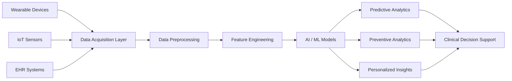
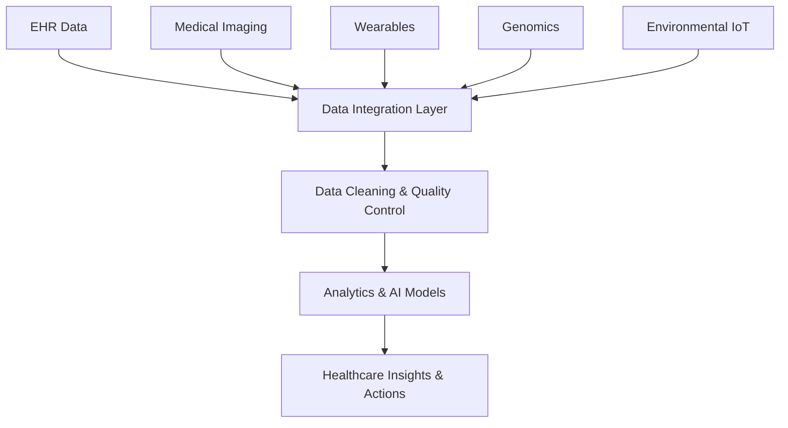
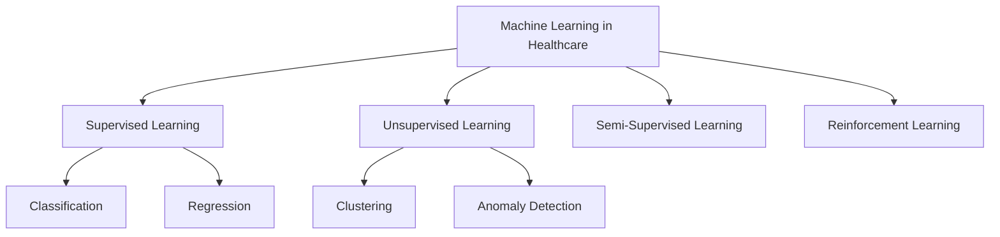
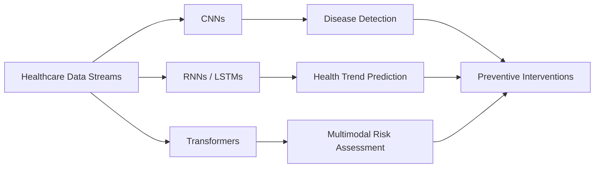
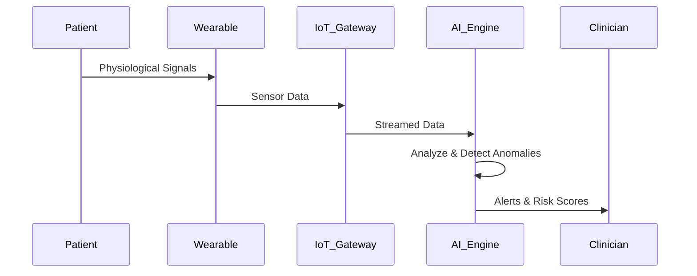
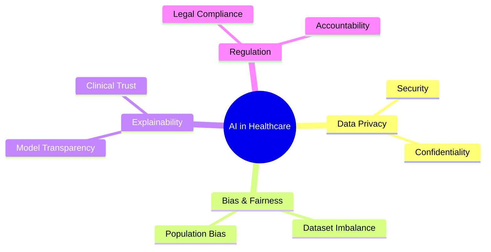

# Figures: Intelligent Healthcare Analytics Using Wearables and IoT Data

This document presents the figures used in the chapter **Preventive Healthcare Analytics Using Wearables and IoT Data**. Each figure is provided with its original heading and a Mermaid diagram for easy rendering and reuse.

---

## Figure 1: Architecture of an Intelligent Healthcare Analytics System

---

## Figure 2: Healthcare Data Sources and Analytics Pipeline

---

## Figure 3: Machine Learning Paradigms in Healthcare

---

## Figure 4: AI Models for Predictive and Preventive Healthcare

---

## Figure 5: Remote Patient Monitoring Using AI and IoT

---

## Figure 6: Challenges and Ethical Issues in Intelligent Healthcare Analytics

---

*End of Figures Document*
